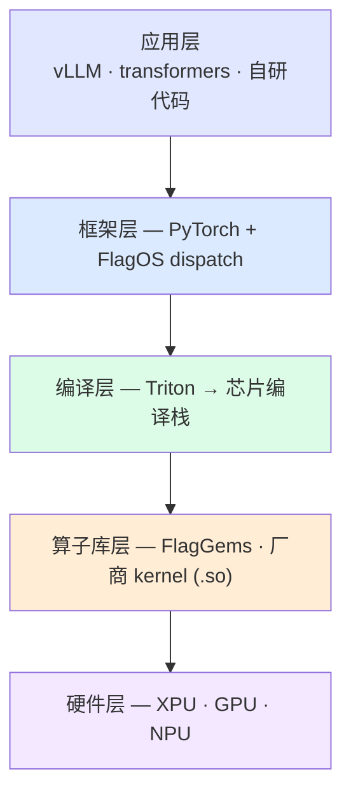

# FlagOS 算子开发模板库

FlagOS 自定义算子开发与验证模板：三条实现路线 × 三层验证层级
构成 9 格矩阵，芯片差异通过[设备 profile](docs/device-profiles.md) 接入。

- 依赖形态: FlagGems + vllm-plugin-FL + vLLM + Triton
- **参考实例**: `configs/devices/p800-kunlunxin.yaml`（9/9 矩阵 +
  跨层一致性的首个完整验证 case）；另有 `cpu.yaml` / `nvidia.yaml`

## 目录

- [体系一图](#map) · [快速开始](#quick) · [矩阵总览](#matrix)
- [文档中心](#docs) · [目录结构](#tree) · [新芯片接入](#onboard)
- [通用注意事项](#notes) · [参考实例记录](#cases)

<a id="map"></a>
## 体系一图



本库的概念映射到上述物理栈:

| 物理层 | 本库在此做的事 |
|---|---|
| **应用层** | [L4 framework 验证](docs/testing.md#framework)（真实推理注入·调用计数·输出比对·黄金回归） |
| **框架层** | [L2 op 验证](docs/testing.md#levels)（注册·分发·拦截）；A1 = aten dispatcher 注册，A2 = FlagOS dispatch 注册 |
| **编译层** | [TR 开发层级](docs/architecture.md#levels)——Triton DSL 经此编译到设备码 |
| **算子库层** | [L0 kernel 验证](docs/testing.md#kernel-level)（直测·[哨兵](docs/testing.md#sentinel)·性能）；[FW](docs/architecture.md#levels) = ATen 组合/C++ extension，[HW](docs/architecture.md#levels) = 厂商 kernel 直测；B = vendor backend 注册 |
| **硬件层** | [设备 profile](docs/device-profiles.md) 接入不同芯片 |

<a id="quick"></a>
## 快速开始

```bash
# 全矩阵（9 格 + consistency；时长视设备而定）
DEVICE=<profile名> ./scripts/run_all.sh

# 单格（示例用参考 profile，替换为你的芯片即可）
python3 run.py --route a1 --level op --device p800-kunlunxin

# 列出可用设备 profile 与矩阵
python3 run.py --list
```

<a id="matrix"></a>
## 矩阵总览（3 路线 × 3 层级 = 9 格）

| | [kernel 层](docs/testing.md#kernel-level) | op 层 | framework 层 |
|---|---|---|---|
| **A1** [aten dispatcher 路线](docs/route-a1-aten.md) | Triton kernel 直测 | aten 注册+拦截 | aten 恒等计数注入 |
| **A2** [FlagOS dispatch 路线](docs/route-a2-dispatch.md) | Triton kernel 直测 | dispatch 注册+策略切换 | vendor 身份注入 |
| **B** [vendor backend 路线](docs/route-b-vendor.md) | **厂商 kernel 直测 + [C++ JIT 闭环](docs/route-b-vendor.md#csrc) + [哨兵检查](docs/testing.md#sentinel)** | vendor 注册/选择 | audit vendor 拦截 |

另有 [`--consistency`](docs/testing.md#consistency) 同算子 L0↔L2 一致矩阵；
**全链路开发**（单一算子贯穿三层）见[全链路指南](docs/fullstack-guide.md) ⭐。

<a id="docs"></a>
## 文档中心

完整中文文档在 [docs/](docs/index.md)，按任务入口:

| 任务 | 文档 |
|---|---|
| 5 分钟上手 | [快速开始](docs/getting-started.md) |
| 理解设计 | [体系结构](docs/architecture.md) |
| 三条路线 | [A1 aten](docs/route-a1-aten.md) · [A2 dispatch](docs/route-a2-dispatch.md) · [B vendor](docs/route-b-vendor.md) |
| 测试与断言 | [测试体系](docs/testing.md) |
| 从源码到推理 | [全链路指南](docs/fullstack-guide.md) ⭐ |
| 接入新芯片 | [设备接入](docs/device-profiles.md#onboard) |
| 写开发报告 | [报告指南](docs/reporting.md) |
| 排查问题 | [已知问题](docs/known-issues.md#method) |
| 贡献代码 | [CONTRIBUTING](CONTRIBUTING.md) |
| 查看版本变更 | [CHANGELOG](CHANGELOG.md) |
| 可运行样例 | [examples/](examples/README.md)（9 格 + 4 全链路/专项，标注[开发层级](docs/architecture.md#levels)） |

<a id="tree"></a>
## 目录结构

```
flagos-op-templates/
├── run.py                    统一矩阵入口
├── configs/devices/          设备 profile（参考实例 p800 + cpu/nvidia/_template）
├── docs/                     中文文档（含全链路指南/报告指南）
├── common/                   设备抽象 / KernelSpec / 输入模板 / 参考实现
├── routes/                   三条路线正式实现（a1_aten / a2_dispatch / b_vendor）
├── examples/                 9 矩阵格 + 4 全链路/专项样例
├── tests/                    kernel_level / op_level / framework_level
├── injection/                A1 框架级 sitecustomize 跨进程注入桥
├── inputs/                   声明式输入模板（spec.yaml）
├── golden/                   黄金输出（多快照+共识前缀）
├── templates/                算子开发报告模板
└── scripts/                  一键脚本/黄金/漂移/输入生成/环境快照/报告骨架
```

<a id="onboard"></a>
## 新芯片接入（4 步）

1. 复制 `configs/devices/_template.yaml` 为 `<芯片名>.yaml`
2. `run.py --all --device <芯片名>` 跑 9 格 + consistency
3. 有厂商 C++ kernel 按 [BUILD.md](routes/b_vendor/csrc/BUILD.md) 接入
   并声明 `vendor_kernels`（含哨兵负例）
4. 建立该设备的[黄金](docs/testing.md#golden)、[漂移基线](docs/testing.md#drift)
   与[已知问题清单](docs/known-issues.md)

<a id="notes"></a>
## 通用注意事项

1. **插件入口函数名**: 代码实际查找 `register` / `vllm_fl_register`
2. **断言分两种**: 恒等路径逐 prompt 前缀一致（按黄金自适应）；
   自定义数值实现用前 2 token 一致率（详见[断言策略](docs/testing.md#assertions)）
3. **输入模板化**: 同一 spec 跨硬件生成相同输入（黄金可比的前提）
4. **黄金输出**: CPU transformers 参考 + 加速卡 vLLM
5. **性能短采样**（≤100 次）: 长循环触发分配器池增长失真
6. **vLLM 前向在子进程**: aten 路线需 sitecustomize 注入桥（已内置）

<a id="cases"></a>
## 参考实例的实测记录

P800 case 的设备特有问题（厂商 kernel 缺陷/栈怪癖/数值行为）沉淀在
[known-issues](docs/known-issues.md)，附**通用检测方法表**
（哨兵检查 / 逐设备直测 / 黄金回归 / 漂移实验）——每接入新芯片，
用同样方法建立该设备自己的清单。
