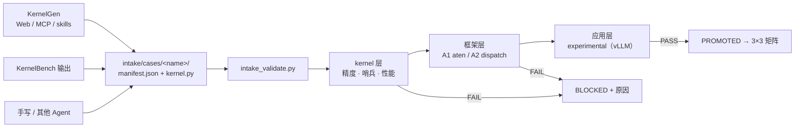

# AI 生成算子接入（intake）

[← 返回文档中心](index.md)

## 它解决什么问题

FlagOS 生态已有 **KernelGen**（Agent 驱动的 Triton kernel 生成→优化→
测试平台）与 **KernelGenBench**（生成能力评测基准）。本库不做生成，
只做**生成之后的验证**——任何来源产出的 kernel 落盘成统一契约，
即可自动进入本库三级验证:



## 三条生成入口

三条入口最终都收敛到同一个动作: 把产物放进 `intake/cases/<name>/`
并填好 manifest。区别只在"谁来放"——Web 平台是人复制粘贴，MCP/
skills 是 Agent 直接写文件，KernelBench 需要一次格式转换。对验证
侧来说来源无关紧要，manifest 里的 `source` 字段只是留个溯源线索。

| 入口 | 产出方式 | 落盘约定 |
|---|---|---|
| [KernelGen Web](https://kernelgen.flagos.io) | 平台导出生成 kernel | 复制到 `intake/cases/<name>/kernel.py` + 填 manifest |
| [KernelGen MCP / skills](https://github.com/flagos-ai/skills) | Agent 生成并写文件 | Agent 直接产出整个 case 目录 |
| [KernelGenBench](https://github.com/flagos-ai/KernelGenBench) | 评测输出 | 转换为 manifest（`source: kernelbench`） |

外部链接:
[KernelGen](https://github.com/flagos-ai/KernelGen) ·
[flagos-ai/skills](https://github.com/flagos-ai/skills) ·
[KernelGen MCP（ModelScope）](https://www.modelscope.cn/mcp/servers/flagos-ai/FlagOS_KernelGen)

## 契约

```
intake/cases/<name>/
  manifest.json     # 唯一入口: 来源/语义/输入/容差/目标层级
  kernel.py         # 生成产物（Triton 级 kernel 或硬件级绑定）
  reference.py      # 参考实现（可选；缺省用 op 语义参考）
```

manifest 关键字段（完整定义见 [manifest.schema.json](../intake/manifest.schema.json)）:

| 字段 | 说明 |
|---|---|
| `source` | `kernelgen` / `kernelbench` / `manual` |
| `op` | 语义锚点（`gelu_and_mul` 等），对齐 `common/kernel_spec.py` 的 `SEMANTIC_REFS` |
| `kernel` / `reference` | 模块文件 + 入口函数 |
| `inputs` | name/shape/dtype/scale/seed，可复现生成 |
| `tolerance` | `max_abs_err` |
| `perf` | 性能测量的 shape/dtype/warmup/iters |
| `framework` | 框架层注册信息（A1 `aten_op` 或 A2 `op_name/impl_id/vendor`） |
| `targets` | 申请的路线（a1/a2）与层级（kernel/op/framework） |
| `expect` | `ok` 正例 / `blocked` 负例（负例用于验证拦截能力） |

## 验证命令

```bash
python3 scripts/intake_validate.py intake/cases/kernelgen-gelu-example
python3 scripts/intake_validate.py                     # 全部 case
python3 scripts/intake_validate.py --validate-only     # 仅契约校验（CI）
```

三级内容:

| 层级 | 内容 | 结果 |
|---|---|---|
| kernel 层 | 精度 vs 参考 · 哨兵（确定性+输入敏感）· 性能（写入 perf 记录） | PASS/FAIL |
| 框架层 | A1 `torch.library` 拦截 或 A2 `OpImpl` 注册 + `with_allowed_vendors` 钉选 | PASS/FAIL/SKIP |
| 应用层 | experimental（需 vLLM 引擎，参照 [b-fullstack](../examples/b-fullstack/) 的 PER_OP 注入） | 默认 SKIP |

输出: `results/intake/<name>_report.md` + `<name>.json`；
性能记录自动进入 [性能回归](performance-regression.md) 的 `intake` group。

## 内置示例

两个内置 case 一正一负，演示的正是这套通道的核心价值主张: 正例走完
从落盘到 PROMOTED 的全流程；负例故意埋了本栈最常见的静默缺陷
（裸 Triton 缺 device 上下文），看验证体系能不能自己抓出来——
答案是哨兵检查在 kernel 层直接拦截，返回机器可读的失败原因。
如果生成侧接的是 MCP/Agent，这个原因可以直接回喂给下一轮生成。

| case | 演示 | P800 实测 |
|---|---|---|
| [kernelgen-gelu-example](../intake/cases/kernelgen-gelu-example/) | 正例: 完整契约 + A2 注册 | PROMOTED（kernel+op PASS） |
| [kernelgen-gelu-no-device-context](../intake/cases/kernelgen-gelu-no-device-context/) | 负例: 裸 Triton 缺 device 上下文 | BLOCKED-OK（哨兵检出 [#11](known-issues.md)） |

负例展示了 intake 的核心价值: 生成 kernel 的"能跑但结果错"类缺陷
（静默 no-op、不写输出）由哨兵检查在 kernel 层直接拦截，并给出
机器可读的失败原因，供生成侧迭代。

## 新增一个生成 case

1. 新建 `intake/cases/<name>/`，放入 `kernel.py`（生成产物）
2. 复制正例的 `manifest.json`，改 `name/source/op/inputs/framework`
3. `python3 scripts/intake_validate.py intake/cases/<name>`
4. PROMOTED 后可把实现迁入 `routes/` 或作为 [样例](../examples/README.md)，
   并保留 intake case 作为生成侧回归锚点

---

**下一步**: [已知问题](known-issues.md)——intake 拦截的典型缺陷
（静默 no-op、不写输出）的完整归因与检测方法。
