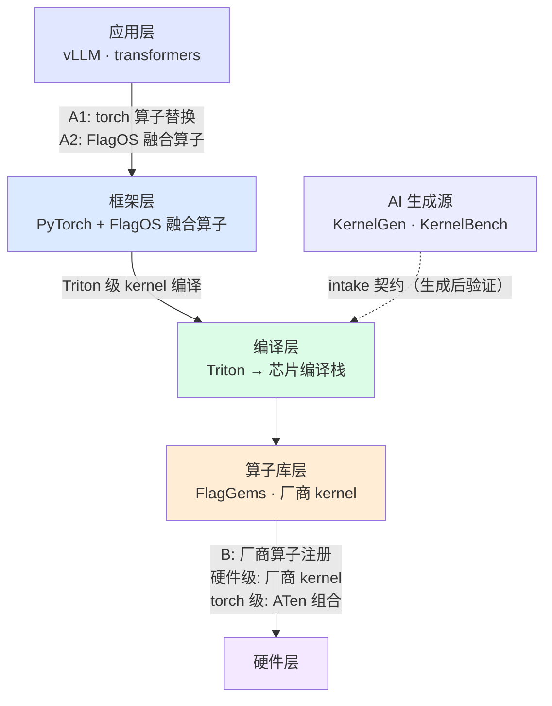

# 体系结构

[← 返回文档中心](index.md)

> 这一页解释整个库的设计：3×3 矩阵怎么读、开发级别为什么和接入
> 路线是两个独立的选择、每类代码放在哪个目录。理解了这些，其余
> 文档只是在填充细节；要动手开发，直接看[全链路指南](fullstack-guide.md)。

<a id="matrix"></a>
## 3×3 验证矩阵

**三条实现路线 × 三层验证层级**（对应[物理栈](index.md)各层），每格独立可跑（`run.py --route X --level Y`）:

| | 算子库层 · kernel 直测 | 框架层 · op 注册/分发 | 应用层 · framework 验证 |
|---|---|---|---|
| **A1** [torch 算子替换](route-a1-aten.md) | Triton kernel 直测 | aten 注册+拦截 | aten 恒等计数注入 |
| **A2** [FlagOS 融合算子](route-a2-dispatch.md) | Triton kernel 直测 | dispatch 注册+策略切换 | vendor 身份注入 |
| **B** [厂商算子注册](route-b-vendor.md) | **厂商 kernel 直测 + [C++ JIT 编译闭环](route-b-vendor.md#csrc) + [哨兵检查](testing.md#sentinel)** | vendor 注册/选择 | audit vendor 拦截 |

附加维度: [`--consistency`](testing.md#consistency) 算子库层直调 ↔ 框架层 dispatch 张量级一致矩阵。

<a id="levels"></a>
## 开发级别（kernel 用什么写）

三个级别按工具链抽象度从高到低排列:

| 级别 | 写什么 | 编译/执行 | 本库覆盖 |
|---|---|---|---|
| **torch 级** | PyTorch/FlagOS 框架内代码: ATen 算子组合、Python 委托、C++ extension 调 ATen | 计算由框架派发（不产生新设备码） | ✅ [b-fullstack](../examples/b-fullstack/)（C++ 调 ATen）、audit vendor |
| **Triton 级** | Triton DSL（`tl.dot`/`pointwise_dynamic`） | Triton 编译器 → 芯片编译栈 → 设备码 | ✅ 本库唯一**自研设备码**路径（[bmm-fullstack](../examples/bmm-fullstack/)、A1/A2 各算子） |
| **硬件级** | 厂商定制语言 kernel（NPU C++/XPU C++/AscendC 等手写设备码） | 厂商工具链编译为 `.so` | ✅ 厂商预编译 kernel 直测+哨兵（[kernel 层](testing.md#kernel-level)）；✅ xtorch_ops 厂商原语组合（[hw-kernel-example](../examples/hw-kernel-example/)）+ CUDA C++ 参考；昆仑芯 SDK 未提供（[SDK 模板已就绪](../examples/hw-kernel-example/sdk_template/BUILD.md)） |

**要点**:
- 开发级别与[实现路线](#routes)正交——路线管"怎么接入"，级别管"用什么写"
- torch 级的算子**不产生新设备码**，价值在融合/粘合与工程接入
- 本栈无公开芯片 ISA/SDK 内联环境，硬件级自研仅 csrc 模板预留
- 已消费的厂商 kernel 中 3 个损坏（[known-issues](known-issues.md)）
- 注意与物理栈"层"区分: 开发**级**描述用什么写，物理栈**层**是系统架构

<a id="routes"></a>
## 为什么是三条路线

路线 = **替换/接入机制**（接到哪），由目标算子的宿主决定，与开发层级正交:



> 术语: **aten** = A Tensor Library，PyTorch 的 C++ 算子分发库。
> `torch.add()` 内部走 `aten::add` → 按 dispatch key 路由到具体实现。
> 本库用 `torch.library.Library("aten","IMPL")` 注册自定义实现。

| 路线 | 适用算子宿主 | 机制 | 典型开发级别 |
|---|---|---|---|
| A1 torch 算子替换 | torch aten 算子（add/gelu/silu…） | `torch.library.Library("aten","IMPL").impl()` 按 dispatch key 注册 | Triton 或 torch |
| A2 FlagOS 融合算子 | vLLM 融合算子（silu_and_mul/rms_norm…） | FlagOS 自研 OpManager / OpRegistry / policy | Triton 或 torch |
| B 厂商算子注册 | 以厂商身份提供的算子 | Backend 子类 + OpImpl VENDOR 注册 | torch 或硬件 |

FlagOS **没有自有 kernel 语言**——编程层复用 Triton（+厂商 kernel），
自研的是"分发"与"可移植"。

## 全链路视角

单格验证之外，[全链路指南](fullstack-guide.md) 演示同一算子贯穿三层，
四个可运行范本:

- [b-fullstack](../examples/b-fullstack/)（torch 级）: C++ kernel → vendor 注册 → 真实 vLLM
- [bmm-fullstack](../examples/bmm-fullstack/)（Triton 级）: Triton BMM → aten 拦截 → 应用层
- [softmax-fullstack](../examples/softmax-fullstack/)（Triton 级）: 流式归约 + autotune
- [backward-example](../examples/backward-example/)（Triton 级）: autograd fwd+bwd

全部 14 个样例在 3×3 矩阵中的位置与涵盖范围见
[样例定位图](../examples/README.md#map)。
AI 生成产物的进入方式见 [AI 生成算子接入](ai-intake.md)。

<a id="tree"></a>
## 目录结构

```
flagos-op-templates/
├── run.py                    统一矩阵入口（--route/--level/--device/--all/--consistency）
├── configs/devices/          [设备 profile](device-profiles.md)
├── docs/                     本文档
├── common/                   设备抽象 / [kernel spec](route-b-vendor.md#kernelspec) / 输入模板
│                            / 参考实现 / [性能基准 harness](performance-regression.md)
├── routes/                   三条路线正式实现
│   ├── a1_aten/              torch 算子替换
│   ├── a2_dispatch/          Triton → FlagOS 融合算子 插件
│   └── b_vendor/             厂商算子注册（csrc + audit）
├── examples/                 14 个样例（9 矩阵格 + 全链路/专项，见[定位图](../examples/README.md#map)）
├── tests/
│   ├── kernel_level/         [kernel 直测层](testing.md#kernel-level) + [一致性](testing.md#consistency)
│   ├── op_level/             注册/分发/拦截层
│   └── framework_level/      [真实推理层](testing.md#framework) + [黄金回归](testing.md#golden)
├── intake/                   [AI 生成算子契约](ai-intake.md)（manifest + 正/负例 case）
├── injection/                A1 框架级 sitecustomize 跨进程注入桥
├── inputs/                   声明式输入模板（spec.yaml → [gen_inputs](testing.md#inputs)）
├── golden/                   [黄金输出](testing.md#golden)（多快照+共识前缀）
├── perf/baselines/           [入库性能基线](performance-regression.md)（按设备 profile 一文件）
├── templates/                [算子开发报告模板](reporting.md)
├── reports/                  生成的报告骨架（gitignore）
└── scripts/                  一键脚本 / [黄金构建](testing.md#golden) / [漂移实验](testing.md#drift)
                             / [输入生成](testing.md#inputs) / [环境快照](reporting.md#env) / [报告骨架](reporting.md#scaffold)
                             / [性能基准与回归](performance-regression.md) / [intake 验证](ai-intake.md)
```

## 矩阵入口约定

- 所有测试模块统一签名 `run(profile)`（[设备 profile](device-profiles.md) 传入），
  返回 `bool` 或 `{"ok": bool, ...指标}`——指标会落盘到结果 JSON 的 `metrics`
- 设备参数全部来自 profile
- 框架级由 [harness](testing.md#framework) 拉起 vLLM 子进程，引擎参数与注入
  环境变量按 profile 与路线自动组装
- 每格结果 JSON 落 `results/`，`scripts/report.py` 汇总成 Markdown

---

**下一步**: [全链路指南](fullstack-guide.md)——跟着一个算子从源码走到推理。
