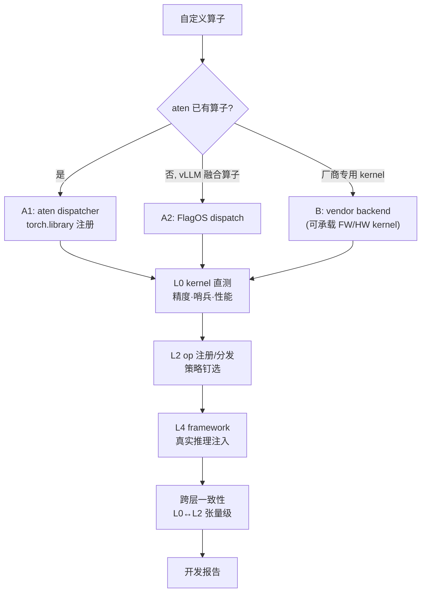

# 体系结构

[← 返回文档中心](index.md)

<a id="matrix"></a>
## 3×3 验证矩阵

**三条实现路线 × 三层验证层级**，每格独立可跑（`run.py --route X --level Y`）:

| | kernel 层（[直测](testing.md#kernel-level)） | op 层（注册/分发/拦截） | framework 层（真实推理） |
|---|---|---|---|
| **A1** [aten dispatcher 路线](route-a1-aten.md) | Triton kernel 直测 | aten 注册+拦截 | aten 恒等计数注入 |
| **A2** [FlagOS dispatch 路线](route-a2-dispatch.md) | Triton kernel 直测 | dispatch 注册+策略切换 | vendor 身份注入 |
| **B** [vendor backend 路线](route-b-vendor.md) | **厂商 kernel 直测 + [C++ JIT 编译闭环](route-b-vendor.md#csrc) + [哨兵检查](testing.md#sentinel)** | vendor 注册/选择 | audit vendor 拦截 |

附加维度: [`--consistency`](testing.md#consistency) 同算子 L0 直调 ↔ L2 dispatch 张量级一致矩阵。

<a id="levels"></a>
## 开发层级（kernel 写在哪一层）

"自定义算子开发"按 kernel 本体的书写位置从高到低分三级——
**框架层 → Triton 层 → 硬件语言层**，抽象度递减、可控性递增:

| 层级 | 写什么 | 编译/执行路径 | 本库覆盖 |
|---|---|---|---|
| **框架层 FW**<br/>模型框架层 | PyTorch/FlagOS 框架内代码: ATen 算子组合、Python 委托、C++ extension 调 ATen | 计算由框架派发到已注册 kernel（不接触设备码） | ✅ [b-fullstack](../examples/b-fullstack/)（C++ 调 ATen）、audit vendor、PyTorch 参考实现 |
| **Triton 层 TR** | Triton DSL（`tl.dot`/`pointwise_dynamic`） | Triton 编译器 → 芯片编译栈 → 设备码；跨芯片可移植 | ✅ 本库唯一**自研设备码**路径（[bmm-fullstack](../examples/bmm-fullstack/)、A1/A2 各算子） |
| **硬件语言层 HW**<br/>NPU 定制语言层 | 厂商定制语言 kernel（NPU C++/XPU C++/AscendC 等手写设备码） | 厂商工具链编译为 `.so` | ✅ 厂商预编译 kernel 直测+哨兵（[kernel 层](testing.md#kernel-level)）；csrc 模板预留自研接口 |

**要点**:
- 三级与三条[实现路线](#routes)正交——路线管"接到哪"（aten/dispatch/vendor
  backend），层级管"kernel 用什么写"。任意组合可行: 如 A1 路线 +
  Triton 层（[bmm-fullstack](../examples/bmm-fullstack/)）、B 路线 +
  框架层（[b-fullstack](../examples/b-fullstack/)）
- 框架层开发的算子**不产生新设备码**，其价值在融合/粘合与工程接入
- 本栈无公开芯片 ISA/SDK 内联环境，硬件语言层自研仅 csrc 模板预留；
  已消费的厂商 kernel 中 3 个损坏（[known-issues](known-issues.md)）
- 注意与[验证三级](#matrix)（kernel/op/framework）区分: 开发层级描述
  **怎么写**，验证层级描述**在哪验**。为避免歧义，指验证层级时全库
  统一写 "framework 验证层"（L4）而非裸用"框架层"一词



<a id="routes"></a>
## 为什么是三条路线

路线 = **替换/接入机制**（接到哪），由目标算子的宿主决定，与开发层级正交:

| 路线 | 适用算子宿主 | 机制 | 典型 kernel 层级 |
|---|---|---|---|
| A1 aten dispatcher | torch aten 算子（add/gelu/silu…） | `torch.library.Library("aten","IMPL").impl()` 按 dispatch key 注册 | TR 或 FW |
| A2 FlagOS dispatch | vLLM 融合算子（silu_and_mul/rms_norm…） | FlagOS 自研 OpManager / OpRegistry / policy | TR 或 FW |
| B vendor backend | 以厂商身份提供的算子 | Backend 子类 + OpImpl VENDOR 注册 | FW 或 HW |

FlagOS **没有自有 kernel 语言**——编程层复用 Triton（+厂商 kernel），
自研的是"分发"与"可移植"。

## 全链路视角

单格验证之外，[全链路指南](fullstack-guide.md) 演示同一算子贯穿三层，
两个可运行范本:

- [b-fullstack](../examples/b-fullstack/)（框架层 FW）: C++ kernel → vendor 注册 → 真实 vLLM
- [bmm-fullstack](../examples/bmm-fullstack/)（Triton 层 TR）: Triton BMM → aten 拦截 → 应用层
- [softmax-fullstack](../examples/softmax-fullstack/)（Triton 层 TR）: 流式归约 + autotune
- [backward-example](../examples/backward-example/)（Triton 层 TR）: autograd fwd+bwd

全部 13 个样例在 3×3 矩阵中的位置与涵盖范围见
[样例定位图](../examples/README.md#map)。

<a id="tree"></a>
## 目录结构

```
flagos-op-templates/
├── run.py                    统一矩阵入口（--route/--level/--device/--all/--consistency）
├── configs/devices/          [设备 profile](device-profiles.md)（芯片泛化核心）
├── docs/                     本文档
├── common/                   设备抽象 / [kernel spec](route-b-vendor.md#kernelspec) / 输入模板 / 参考实现
├── routes/                   三条路线正式实现
│   ├── a1_aten/              aten dispatcher 路线
│   ├── a2_dispatch/          Triton → FlagOS dispatch 插件
│   └── b_vendor/             vendor backend 路线（csrc + audit）
├── examples/                 9 个矩阵格样例 + [b-fullstack 旗舰](fullstack-guide.md)
├── tests/
│   ├── kernel_level/         [kernel 直测层](testing.md#kernel-level) + [一致性](testing.md#consistency)
│   ├── op_level/             注册/分发/拦截层
│   └── framework_level/      [真实推理层](testing.md#framework) + [黄金回归](testing.md#golden)
├── injection/                A1 框架级 sitecustomize 跨进程注入桥
├── inputs/                   声明式输入模板（spec.yaml → [gen_inputs](testing.md#inputs)）
├── golden/                   [黄金输出](testing.md#golden)（多快照+共识前缀）
├── templates/                [算子开发报告模板](reporting.md)
├── reports/                  生成的报告骨架（gitignore）
└── scripts/                  一键脚本 / [黄金构建](testing.md#golden) / [漂移实验](testing.md#drift)
                             / [输入生成](testing.md#inputs) / [环境快照](reporting.md#env) / [报告骨架](reporting.md#scaffold)
```

## 矩阵入口约定

- 所有测试模块统一签名 `run(profile) -> bool`（[设备 profile](device-profiles.md) 传入）
- 测试代码零硬编码设备串/卡号/厂商库名
- 框架级由 [harness](testing.md#framework) 拉起 vLLM 子进程，引擎参数与注入
  环境变量按 profile 与路线自动组装
- 每格结果 JSON 落 `results/`，`scripts/report.py` 汇总成 Markdown
