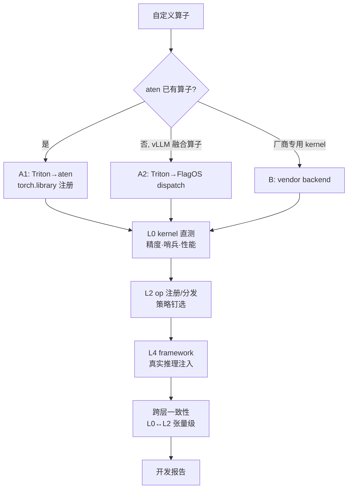

# 体系结构

[← 返回文档中心](index.md)

<a id="matrix"></a>
## 3×3 验证矩阵

**三条实现路线 × 三层验证层级**，每格独立可跑（`run.py --route X --level Y`）:

| | kernel 层（[直测](testing.md#kernel-level)） | op 层（注册/分发/拦截） | framework 层（真实推理） |
|---|---|---|---|
| **A1** [Triton→aten](route-a1-aten.md) | Triton kernel 直测 | aten 注册+拦截 | aten 恒等计数注入 |
| **A2** [Triton→dispatch](route-a2-dispatch.md) | Triton kernel 直测 | dispatch 注册+策略切换 | vendor 身份注入 |
| **B** [厂商语言→vendor](route-b-vendor.md) | **厂商 kernel 直测 + [C++ JIT 编译闭环](route-b-vendor.md#csrc) + [哨兵检查](testing.md#sentinel)** | vendor 注册/选择 | audit vendor 拦截 |

附加维度: [`--consistency`](testing.md#consistency) 同算子 L0 直调 ↔ L2 dispatch 张量级一致矩阵。

<a id="levels"></a>
## 开发层级（kernel 到底写在哪一层）

"自定义算子开发"按 kernel 本体的书写与编译方式分三个层级，本库的覆盖范围如下:

| 层级 | kernel 本体 | 编译路径 | 本库覆盖 |
|---|---|---|---|
| **L-K1 Triton DSL** | Triton 语言（`tl.dot`/`pointwise_dynamic`） | Triton 编译器 → XMLIR → XPU 设备码 | ✅ 多个自研 kernel（[bmm-fullstack](../examples/bmm-fullstack/)、A1/A2 各算子）——**真·自研设备 kernel** |
| **L-K2 C++ torch extension** | C++ 调 ATen 算子 | nvcc 编译宿主码 + pybind 绑定 | ✅ [b-fullstack](../examples/b-fullstack/)（silu_and_mul csrc）——演示**工程链路**（编译→加载→vendor 注册），计算内核仍派发 ATen |
| **L-K3 厂商预编译 kernel** | 不写 kernel，直接调厂商库 | 厂商 `.so`（如 `xtorch_ops`） | ✅ 直测+哨兵（[kernel 层](testing.md#kernel-level)）——本栈实测多个损坏 |

**范围界定**: L-K1 是本库唯一"写到设备码"的自研路径；L-K2 覆盖 C++ 接入
路线（若厂商提供 SDK 头文件，同一框架可承载真正的厂商语言 kernel）；
L-K3 只做消费与质量验证（[known-issues](known-issues.md) 中 3 个损坏
kernel 均在此层检出）。三条[实现路线](#routes) × 三个开发层级自由组合，
例如 A1 路线可用 L-K1 kernel 替换 aten 算子，B 路线可承载 L-K2/L-K3。

> 注: 本栈无公开的芯片 ISA/SDK 内联开发环境，L-K2 的"真厂商语言"形态
> （C++ 设备函数内联）以 csrc 模板预留接口，未含自研示例。



<a id="routes"></a>
## 为什么是三条路线

FlagOS 的算子替换发生在**两个层次**，加上芯片层共三条路线:

| 层次 | 算子类型 | 机制 |
|---|---|---|
| torch 层 | aten 算子（add/gelu/silu…） | `torch.library.Library("aten","IMPL").impl()` 按 dispatch key 注册 |
| vLLM 层 | 融合算子（silu_and_mul/rms_norm…） | FlagOS 自研 OpManager / OpRegistry / policy |
| 芯片层 | 厂商 C++/SDK kernel | vendor backend（Backend 子类 + OpImpl VENDOR 注册） |

FlagOS **没有自有 kernel 语言**——编程层复用 Triton（+厂商 kernel），
自研的是"分发"与"可移植"。

## 全链路视角

单格验证之外，[全链路指南](fullstack-guide.md) 演示同一算子贯穿三层
（kernel 直测 → dispatch 注册 → 真实推理），旗舰样例
[examples/b-fullstack](../examples/b-fullstack/) 可直接运行。

<a id="tree"></a>
## 目录结构

```
flagos-op-templates/
├── run.py                    统一矩阵入口（--route/--level/--device/--all/--consistency）
├── configs/devices/          [设备 profile](device-profiles.md)（芯片泛化核心）
├── docs/                     本文档
├── common/                   设备抽象 / [kernel spec](route-b-vendor.md#kernelspec) / 输入模板 / 参考实现
├── routes/                   三条路线正式实现
│   ├── a1_aten/              Triton → torch dispatcher
│   ├── a2_dispatch/          Triton → FlagOS dispatch 插件
│   └── b_vendor/             厂商语言 → vendor backend（csrc + audit）
├── examples/                 9 个矩阵格样例 + [b-fullstack 旗舰](fullstack-guide.md)
├── tests/
│   ├── kernel_level/         [kernel 直测层](testing.md#kernel-level) + [一致性](testing.md#consistency)
│   ├── op_level/             注册/分发/拦截层
│   └── framework_level/      [真实推理层](testing.md#framework) + [黄金回归](testing.md#golden)
├── injection/                A1 框架级 sitecustomize 跨进程注入桥
├── inputs/                   声明式输入模板（spec.yaml → [gen_inputs](testing.md#inputs)）
├── golden/                   [黄金输出](testing.md#golden)（多快照+共识前缀）
├── templates/                [算子开发报告模板](reporting.md)
├── reports/                  生成的报告骨架（gitignore）
└── scripts/                  一键脚本 / [黄金构建](testing.md#golden) / [漂移实验](testing.md#drift)
                             / [输入生成](testing.md#inputs) / [环境快照](reporting.md#env) / [报告骨架](reporting.md#scaffold)
```

## 矩阵入口约定

- 所有测试模块统一签名 `run(profile) -> bool`（[设备 profile](device-profiles.md) 传入）
- 测试代码零硬编码设备串/卡号/厂商库名
- 框架级由 [harness](testing.md#framework) 拉起 vLLM 子进程，引擎参数与注入
  环境变量按 profile 与路线自动组装
- 每格结果 JSON 落 `results/`，`scripts/report.py` 汇总成 Markdown
