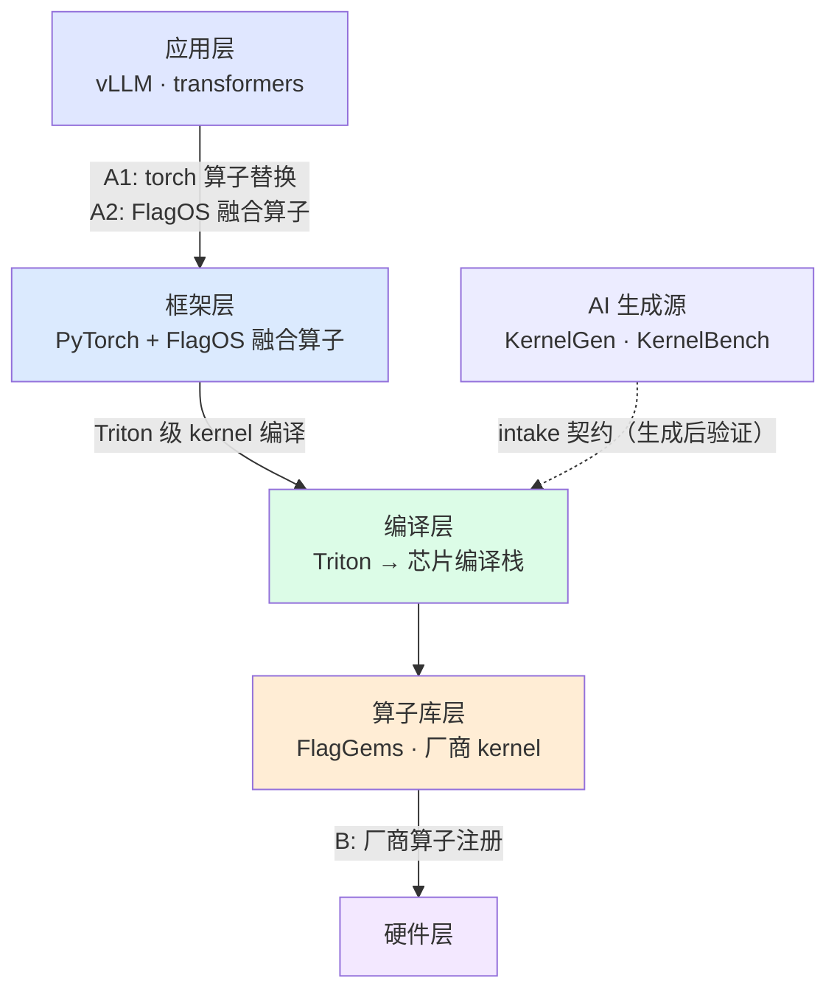

# 文档中心

[← 返回仓库首页](../README.md)

## 阅读路径

这套文档分四个层次：快速开始、体系结构、全链路指南、测试体系是
主线，带你从跑通到理解、再到独立开发；开发完成后的交付走集成指南
（路径选择与分发开销）；性能回归和 AI 生成算子是两个专题，按需
阅读；路线详解、设备接入、报告指南属于参考，用到再查。

```
新手:  1.快速开始 → 2.体系结构 → 3.全链路指南 → 4.测试体系 → 5.已知问题
      （性能与 AI 生成按需走下方专题线）
深入:  A1/A2/B 路线详解 · 设备接入 · 报告指南 · 样例索引
性能:  perf_run 采集 → perf_compare 门禁 → 基线更新规范
生成:  KernelGen/KernelBench 产物 → intake 契约 → 三级验证
交付:  宿主定路径 → 分发开销实测 → FlagGems 贡献或插件注册
排障:  已知问题(按类别检索) → 定位到检测方法 → 修正
```

## 体系总览



| 物理栈层 | 验证 | 路线 | 开发级别 |
|---|---|---|---|
| **应用层** | [framework 验证](testing.md#framework) | — | — |
| **框架层** | [op 验证](testing.md#levels) | [A1](route-a1-aten.md) · [A2](route-a2-dispatch.md) | — |
| **编译层** | — | — | [Triton 级](architecture.md#levels) |
| **算子库层** | [kernel 验证](testing.md#kernel-level) | [B](route-b-vendor.md) | [torch 级](architecture.md#levels) · [硬件级](architecture.md#levels) |
| **硬件层** | — | — | —（[设备 profile](device-profiles.md)） |

## 按任务找入口

| 我想… | 去哪 |
|---|---|
| 5 分钟跑通 | [快速开始](getting-started.md) |
| 从样板开始开发新算子 | [算子样板](../templates/operator/README.md)（copy-paste 起点） |
| 理解整体设计 | [体系结构](architecture.md) |
| 开发 torch 算子替换 | [A1 路线](route-a1-aten.md) |
| 开发 FlagOS 融合算子 | [A2 路线](route-a2-dispatch.md) |
| 接入厂商 kernel | [B 路线](route-b-vendor.md) |
| 完整走一遍开发 | [全链路指南](fullstack-guide.md)（七步流水线 + 覆盖矩阵） |
| 开发完成后交付/集成 | [集成指南](integration.md)（路径选择 + 分发开销实测） |
| 理解每层验证 | [测试体系](testing.md) |
| 追踪性能回归 | [性能回归追踪](performance-regression.md) |
| 接入 AI 生成的算子 | [AI 生成算子接入](ai-intake.md) |
| 接入新芯片 | [设备接入](device-profiles.md) |
| 写开发报告 | [报告指南](reporting.md) |
| 排查问题 | [已知问题](known-issues.md) |
| 看可运行样例 | [样例索引](../examples/README.md) |

## 术语

| 术语 | 含义 | 详见 |
|---|---|---|
| 路线 | 接入机制: A1 torch 算子替换 / A2 FlagOS 融合算子 / B 厂商算子注册 | [体系结构](architecture.md#routes) |
| 开发级别 | kernel 用什么写: torch 级 / Triton 级 / 硬件级 | [体系结构](architecture.md#levels) |
| 验证层级 | 在物理栈哪一层验: 算子库层 / 框架层 / 应用层 | [测试体系](testing.md#levels) |
| 哨兵检查 | 检测 kernel 是否真实产出 | [测试体系](testing.md#sentinel) |
| 黄金输出 | 多快照共识回归锚点 | [测试体系](testing.md#golden) |
| 跨层一致性 | 同算子在算子库层↔框架层张量级比对 | [测试体系](testing.md#consistency) |
| 设备 profile | 芯片差异的 YAML 声明 | [设备接入](device-profiles.md) |
| aten | A Tensor Library，PyTorch 的算子分发库 | [体系结构](architecture.md#routes) |
| 性能基线 | 入库的结构化性能基准，供回归对比 | [性能回归追踪](performance-regression.md) |
| intake 契约 | AI 生成算子落盘验证的 manifest 约定 | [AI 生成算子接入](ai-intake.md) |
