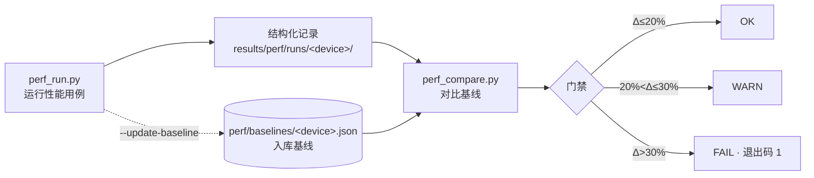

# 性能回归追踪

[← 返回文档中心](index.md)

## 为什么需要

样例里的 `性能: Triton=0.030ms` 只是一次性打印——改动 kernel 后
无法回答"比上一版快了还是慢了"。本机制把性能数据变成**结构化记录
+ 入库基线 + 对比门禁**:



## 使用

```bash
# 1. 运行全部性能用例（样例 + kernel 层矩阵格）
python3 scripts/perf_run.py --device p800-kunlunxin

# 2. 对比入库基线（CI / 本地门禁）
python3 scripts/perf_compare.py --device p800-kunlunxin

# 3. 有意更新基线（语义变更 / 环境升级后）
python3 scripts/perf_run.py --device p800-kunlunxin --update-baseline

# 过滤
python3 scripts/perf_run.py --device ... --pattern bmm
python3 scripts/perf_run.py --list
```

每个用例在**独立子进程**中执行——同进程连续跑多个用例会触发
分配器池增长污染（实测同一 C++ kernel 顺序跑 0.31ms、全量混跑
1.69ms，见 [已知问题](known-issues.md) #10），隔离后每条记录才是
健康态数值。

## 覆盖范围（第一期）

| group | 来源 | 用例数 |
|---|---|---|
| `example` | 6 个含性能测量的样例（a2-op / b-fullstack / bmm / softmax / backward / hw-kernel） | 12 |
| `matrix-kernel` | kernel 层矩阵格（a1 / a2 / b） | 3 |
| `intake` | [AI 生成算子](ai-intake.md)验证时的性能记录 | 按 case |

op/framework 层暂不入基线：注册与分发开销混入计时会让数据解读复杂，
`group` 字段为后续扩展预留。

## 阈值语义

| 判定 | 条件（相对基线 latency_ms） | 含义 |
|---|---|---|
| OK | 慢 ≤ 20% | 计时抖动容忍区 |
| WARN | 慢 20%~30% | 输出告警，不阻断 |
| FAIL | 慢 > 30% | 退出码 1，阻断提交 |
| NEW | 基线中不存在 | 新用例，不判失败 |

- 门禁只作用于 `latency_ms`；`GBps` / `TFLOPS` 等派生指标仅展示
- 阈值可用 `--warn/--fail` 调整（如共享设备放宽到 0.3/0.5）
- 基线与当前的 git commit、软件栈版本差异会打印提示但不阻断

## 基线文件

`perf/baselines/<device>.json`（入库），每用例保存:

| 字段 | 含义 |
|---|---|
| `metrics.latency_ms` | 门禁基准值 |
| `warmup` / `iters` | 采样口径（短采样 ≤100 次，避免分配器池增长失真） |
| `git_commit` / `git_dirty` | 基线采集点 |
| `env_fingerprint` | torch/triton/flag_gems/vllm_fl/vllm 版本 |

更新基线 = 显式 `--update-baseline` + 提交信息说明原因（算子语义变更、
环境升级、用例 shape 调整）。日常代码改动不允许顺手更新基线。

## 新增用例

样例或矩阵测试中实现 `perf_cases(profile)`:

```python
def perf_cases(profile):
    from common.perf import PerfCase
    def make(p):
        x = torch.randn(1024, 1024, dtype=torch.bfloat16, device=p.torch_device)
        return lambda: my_kernel(x)
    return [PerfCase("example.my.my_kernel", group="example",
                     level="kernel", make_fn=make)]
```

然后在 `common/perf_registry.py` 的 `PROVIDERS` 里登记文件路径即可。

## 与其他机制的关系

- [样例性能速览](../examples/README.md#perf): 一次性对比展示（人读）
- 本页: 可重复回归门禁（机器判）
- [测试体系](testing.md): 精度/哨兵/一致性（正确性维度）
- [报告指南](reporting.md): 报告第 5 章性能数据可引用基线与对比结论

---

**下一步**: [AI 生成算子接入](ai-intake.md)——生成 kernel 的性能记录
自动进入本体系（`intake` group）。
