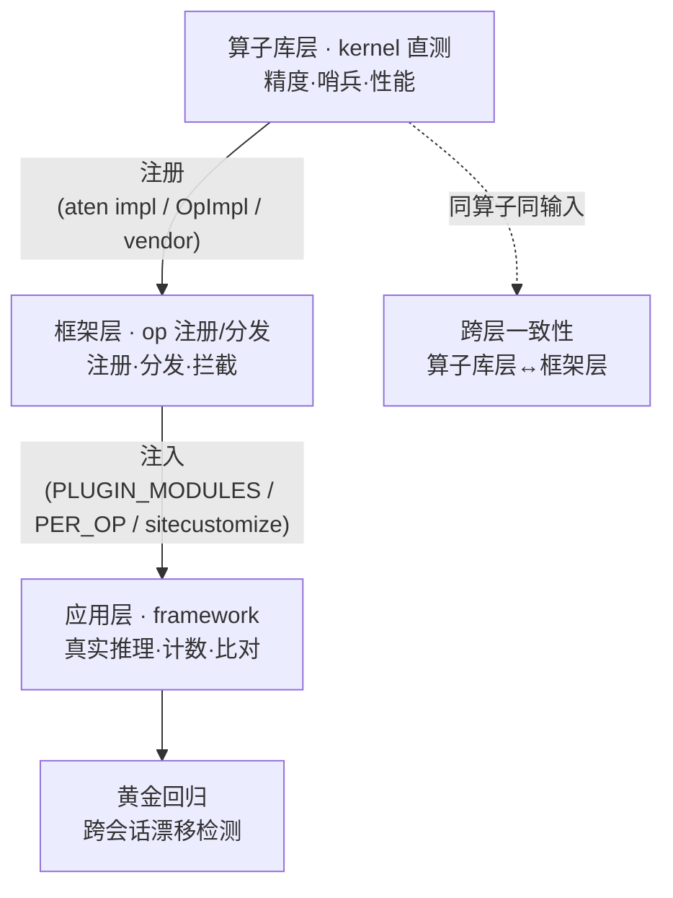

# 测试体系

[← 返回文档中心](index.md)

## 目录

- [三层验证](#levels) · [kernel 层](#kernel-level) · [framework 层](#framework)
- [断言策略](#assertions)
- [测试输入模板](#inputs)
- [黄金输出](#golden) · [漂移实验](#drift) · [跨层一致性](#consistency)


| 路线 \ 验证层级 | 算子库层 · kernel 直测 | 框架层 · op 注册/分发 | 应用层 · framework 验证 |
|---|---|---|---|
| **A1** torch 算子替换 | Triton kernel 直测 | aten 注册+拦截 | aten 恒等计数注入 |
| **A2** FlagOS 融合算子 | Triton kernel 直测 | dispatch 注册 | vendor 身份注入 |
| **B** 厂商算子注册 | 厂商 kernel 直测+哨兵 | vendor 注册/选择 | audit vendor 拦截 |

<a id="levels"></a>
## 三层验证



| 层级 | 物理栈位置 | 验证什么 | 形式 | 入口 |
|---|---|---|---|---|
| [kernel 层](#kernel-level) | 算子库层 | kernel 本体: 精度/哨兵/性能 | 直测，秒级 | `--level kernel` |
| op 层 | 框架层 | 注册/分发/拦截正确 | 策略切换验证 | `--level op` |
| [framework 层](#framework) | 应用层 | 真实推理被调用且不破坏输出 | 基线/插件双跑 | `--level framework` |

<a id="kernel-level"></a>
## kernel 层（硬件语言直测）

不经任何注册/分发，直接验证 kernel——**厂商语言路线的核心层**
（详见[路线 B](route-b-vendor.md)）:

1. **精度**: vs PyTorch 语义参考（`common/kernel_spec.py` 的
   `SEMANTIC_REFS`），多 shape×dtype；容差 fp32=1e-5, bf16/fp16=1e-2
2. **哨兵检查**: 见下
3. **性能**: 短采样（≤100 次）+ synchronize

<a id="sentinel"></a>
### 哨兵健全性检查（`sentinel_check`）

通用化的"kernel 不写输出"bug 检测:

| out_mode | 检查方法 | 能抓的问题 |
|---|---|---|
| `out_param` | `torch.full` 哨兵预填 out → 调用 → 检查哨兵被覆写 | kernel 不写输出（参考 case 检出 2 个） |
| `return` | 同输入两次调用一致（确定性）+ 输入变化输出变化（敏感性） | 非确定 kernel / 按设备分化的垃圾输出（检出 1 个） |

厂商 kernel 清单在[设备 profile](device-profiles.md) 的 `vendor_kernels`
段声明，`expected_ok: false` 的条目作为**负例**——验证哨兵的检测能力。

<a id="framework"></a>
## framework 层（harness 编排）

- 输入: [inputs/prompts.txt](#inputs)（统一 tokenize+词表钳制）
- 基线跑: 无插件，贪心解码，记录输出 token ids
- 插件跑: 按 route 注入对应实现，同 prompt 同 seed
- 断言: 调用计数（pid 分片汇总）> 0 + 输出比对 + [黄金回归](#golden)

三条路线注入方式见各自文档（[A1](route-a1-aten.md) /
[A2](route-a2-dispatch.md) / [B](route-b-vendor.md)）。

<a id="assertions"></a>
## 断言策略（两种）

| 场景 | 断言 | 原因 |
|---|---|---|
| 数值恒等路径（aten 恒等覆盖 / audit reference 委托） | 逐 prompt 前缀完全一致 | 数学恒等，位级可比 |
| 自定义数值实现（Triton / C++） | 前 2 token 一致率 ≥ 2/3×N | 随机权重+贪心解码把数值微差混沌放大 |

恒等断言前缀**逐 prompt 自适应**: `max(1, min(8, 黄金稳定长度-1))`
——黄金稳定长度是"已观测到分叉的位置"，取 -1 避免踩线。

<a id="inputs"></a>
## 测试输入模板

- 声明式定义: [inputs/spec.yaml](../inputs/spec.yaml)
  （fixed / length_sweep / edge_cases 文本类 + token_based 算子类）
- 生成: `scripts/gen_inputs.py`（`--check` 校验产物与 spec 一致）
- 同一 spec 在任何硬件生成完全相同的输入——[黄金](#golden)可比的前提
- 框架级统一 `tokenize + 词表钳制`（`PROMPTS_AS_TOKENS=1`），
  规避 embedding 静默越界（[已知问题](known-issues.md)）

<a id="golden"></a>
## 黄金输出（golden outputs）

```bash
python3 scripts/build_golden.py --device cpu        # transformers CPU 权威参考
python3 scripts/build_golden.py --device <加速卡>   # vLLM reference 路径 ×N 快照
python3 scripts/compare_golden.py --devices <加速卡>,cpu
```

- 黄金 = N 次独立运行快照集合 + 逐位置多数票共识前缀
- 落盘 `golden/<device>_golden.json`（含引擎指纹/prompts 哈希，应入库）
- 用途: 跨会话回归检测——栈升级改变数值行为时报警
- CPU 走 HuggingFace transformers 直接推理（最权威语义参考，确定性）
- framework 测试自动比对同设备黄金

<a id="drift"></a>
## 漂移实验

```bash
python3 scripts/drift_study.py --device <profile> --runs 8 --mode reference
python3 scripts/drift_study.py --device <profile> --runs 4 --mode vendor
```

量化跨进程非确定性（逐位置一致率/两两首分歧/全员一致前缀），
校准断言前缀。参考实例结论: 受控条件下两模式连跑全部 100% 确定；
偶发后期 token 漂移为低概率条件相关事件。**新芯片接入建议复跑建立基线**。

<a id="consistency"></a>
## 跨层一致性

```bash
python3 run.py --consistency --device <profile>
```

锚定算子 gelu_and_mul，同一输入张量在四处输出两两比对
（张量级，bf16 容差 1e-2）:

- 算子库层直调 Triton/C++ · 框架层 dispatch `call_op` · PyTorch 参考

参考实例结果: 4×4 全零误差矩阵。这是"同一算子在各层验证一致"的
自动化形态；人工跟读版见[全链路指南](fullstack-guide.md)。
