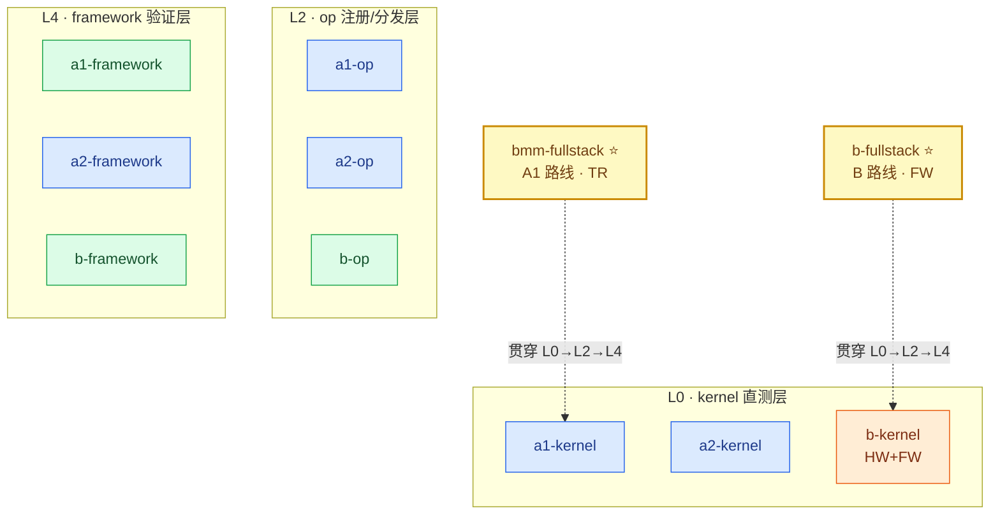

# 样例索引（3 路线 × 3 层级 = 9 格）

每个样例目录 = 一个矩阵格的完整可运行演示。

## 样例定位图（每个样例在矩阵中的位置与涵盖范围）

**读图方式**:
- 每行 = 一个验证层级（L0/L2/L4），行内左→右 = A1 / A2 / B 三条路线
- 节点配色 = [开发层级](../docs/architecture.md#levels):
  🔵 **TR**（Triton 层，自研设备码）· 🟢 **FW**（框架层）· 🟠 **HW**（硬件语言层）
- ⭐ 全链路样例以虚线标注贯穿范围（bmm-fullstack 覆盖 A1 列三层，
  b-fullstack 覆盖 B 列三层）
- b-kernel 同时含 HW（厂商 kernel 直测）与 FW（csrc JIT 编译闭环）

| 样例 | 内容 | 开发层级 |
|---|---|---|
| [a1-kernel](a1-kernel/) | Triton gelu 直测（精度+哨兵+性能） | **TR** |
| [a1-op](a1-op/) | 从零写 Triton relu → aten 注册 → 拦截/精度/性能 | **TR** |
| [a1-framework](a1-framework/) | aten::silu 恒等计数注入真实 vLLM 前向 | **FW**（恒等计数·torch 组合） |
| [a2-kernel](a2-kernel/) | Triton gelu_and_mul 直测 | **TR** |
| [a2-op](a2-op/) | Triton gelu_and_mul → dispatch 双后端 → 三段式 | **TR** |
| [a2-framework](a2-framework/) | Triton silu_and_mul 以 vendor 身份注入真实推理 | **TR** |
| [b-kernel](b-kernel/) | **厂商 kernel 直测 + C++ JIT 编译闭环 + 哨兵检查** | **HW + FW** |
| [b-op](b-op/) | 自定义 vendor backend 注册/选择/计数 | FW（委托） |
| [softmax-fullstack](softmax-fullstack/) | 行归约 + autotune 三层 | **TR** |
| [backward-example](backward-example/) | autograd fwd+bwd + 训练冒烟 | **TR** |
| [bmm-fullstack](bmm-fullstack/) | torch.bmm 贯穿 L0→L2→应用层（含 [#11](../docs/known-issues.md) 根因发现） | **TR** |
| **[b-fullstack](b-fullstack/)** ⭐ | **旗舰: 同一 C++ kernel 贯穿 L0→L2→L4**（JIT 编译→vendor 注册→真实推理，附[开发报告](b-fullstack/report.md)） | **FW** |
| [b-framework](b-framework/) | audit vendor 拦截真实 vLLM + 黄金回归 | FW（委托） |

运行方式统一: `python3 examples/<样例名>/example.py [设备profile名]`。

样例与正式测试（`run.py`）复用同一套基础设施（harness / golden / 设备 profile）；
kernel/op 层样例完全自包含（不依赖 routes/），可直接复制为开发起点。

## 性能速览（参考实例实测）

| 算子 @ shape (bf16) | 最优实现 | 关键数字 | 详见 |
|---|---|---|---|
| silu_and_mul 4096×8192 | Triton 融合 | 0.083ms（C++ 0.271 / 参考 0.651） | [b-fullstack](b-fullstack/) |
| BMM 16×512³ | Triton 分块 | 0.030ms / 142 TFLOPS（原生 1.59x） | [softmax-fullstack](softmax-fullstack/) | 行归约 + autotune 三层 | **TR** |
| [backward-example](backward-example/) | autograd fwd+bwd + 训练冒烟 | **TR** |
| [bmm-fullstack](bmm-fullstack/) |
| gelu 8192² | Triton | 0.047ms（CPU 2341x） | [a1-op](a1-op/) |
| gelu_and_mul 8192² | Triton 融合 | 0.052ms（vs 分解参考 6204x） | [a2-op](a2-op/) |

> 所有数字: 健康态进程、短采样(≤100 次)。共享设备的进程内污染可致
> 200x 级失真（[known-issues](../docs/known-issues.md) #10/#11），勿跨进程直接对比。
