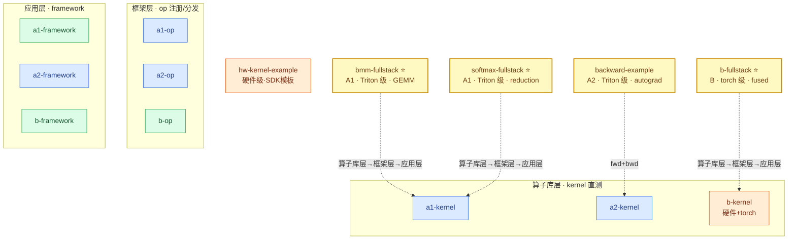

# 样例索引（3 路线 × 3 层级 = 9 格）

这里的每个目录都是一个可以直接运行的样例，对应 3×3 矩阵中的一格，
或者一条贯穿三层的完整链路。先在定位图里找到你关心的路线和层级，
再进对应目录看代码和 README。

## 与算子样板的对应

[softmax-fullstack](softmax-fullstack/) 的目录结构与
[templates/operator](../templates/operator/README.md) **完全同构**
（kernel/ 三级 · test/ 三层 · goldendata/ · script/ · REPORT+reports/，
硬件级置空并说明）——从样板开始开发的人切到它零认知切换。
其余样例是**格级/专项教学**，保持单文件聚焦；新增完整算子样例时
直接复制样板。

| 样例 | 对应样板槽位 | 说明 |
|---|---|---|
| **softmax-fullstack** ⭐ | **全部**（结构同构） | 唯一按样板组织的完整算子样例 |
| a1-kernel / a2-kernel | test/kernel_level | 算子库层直测教学 |
| a1-op / a2-op / b-op | test/op_level + register | 框架层注册教学 |
| a1/a2/b-framework | test/framework_level | 应用层注入教学 |
| bmm-fullstack / b-fullstack | kernel+test 全线（单文件编排） | 全链路叙事版 |
| backward-example | kernel/（反向）| autograd 专项 |
| hw-kernel-example | kernel/hardware_level | 硬件级专项（厂商原语+SDK 模板） |

## 样例定位图

定位图回答"我该看哪个样例"这个问题: 每行是一个物理栈层，行内
从左到右是三条路线，配色标开发级别，虚线标全链路覆盖范围。如果你
不清楚自己在矩阵中的位置，先在这张图上找到坐标，再进对应目录。（每个样例在矩阵中的位置与涵盖范围）

**读图方式**:
- 每行 = 物理栈一层（算子库/框架/应用），行内左→右 = A1 / A2 / B 三条路线
- 想按**开发步骤**（而非矩阵格）找范本，见
  [全链路指南 · 步骤 × 样例覆盖矩阵](../docs/fullstack-guide.md#coverage)
- 节点配色 = [开发层级](../docs/architecture.md#levels):
  🔵 **Triton**（Triton 层，自研设备码）· 🟢 **torch**（框架层）· 🟠 **硬件**（硬件语言层）
- ⭐ 全链路/专项样例以虚线标注覆盖范围（bmm/b-fullstack/softmax 各覆盖
  对应列三层；backward-example 覆盖 A2 列的 fwd+bwd）
- 全链路/专项: bmm-fullstack(GEMM) / b-fullstack(fused) /
  softmax-fullstack(reduction+尾块安全) / backward-example(autograd)
- b-kernel 同时含 硬件（厂商 kernel 直测）与 torch（csrc JIT 编译闭环）

| 样例 | 内容 | 开发层级 |
|---|---|---|
| [a1-kernel](a1-kernel/) | Triton gelu 直测（精度+哨兵+性能） | **Triton** |
| [a1-op](a1-op/) | 从零写 Triton relu → aten 注册 → 拦截/精度/性能 | **Triton** |
| [a1-framework](a1-framework/) | aten::silu 恒等计数注入真实 vLLM 前向 | **torch**（恒等计数·torch 组合） |
| [a2-kernel](a2-kernel/) | Triton gelu_and_mul 直测 | **Triton** |
| [a2-op](a2-op/) | Triton gelu_and_mul → dispatch 双后端 → 三段式 | **Triton** |
| [a2-framework](a2-framework/) | Triton silu_and_mul 以 vendor 身份注入真实推理 | **Triton** |
| [b-kernel](b-kernel/) | **厂商 kernel 直测 + C++ JIT 编译闭环 + 哨兵检查** | **硬件 + torch** |
| [b-op](b-op/) | 自定义 厂商算子注册 注册/选择/计数 | torch（委托） |
| [softmax-fullstack](softmax-fullstack/) | 行归约 + 尾块安全 三层 | **Triton** |
| [backward-example](backward-example/) | autograd fwd+bwd + 训练冒烟 | **Triton** |
| [hw-kernel-example](hw-kernel-example/) | xtorch_ops 厂商原语组合 + CUDA C++ 参考（P800 硬件级） | **硬件级** |
| [bmm-fullstack](bmm-fullstack/) | torch.bmm 贯穿 算子库层→框架层→应用层（含 [#11](../docs/known-issues.md) 根因发现） | **Triton** |
| **[b-fullstack](b-fullstack/)** ⭐ | **旗舰: 同一 C++ kernel 贯穿 算子库层→框架层→应用层**（JIT 编译→vendor 注册→真实推理，附[开发报告](b-fullstack/report.md)） | **torch** |
| [b-framework](b-framework/) | audit vendor 拦截真实 vLLM + 黄金回归 | torch（委托） |

运行方式统一: `python3 examples/<样例名>/example.py [设备profile名]`。

样例与正式测试（`run.py`）复用同一套基础设施（harness / golden / 设备 profile）；
kernel/op 层样例完全自包含（不依赖 routes/），可直接复制为开发起点。

## 性能速览

这张表是"人读"的一次性对比，回答"谁快谁慢、差多少"；可重复的机器
判定走[性能回归追踪](../docs/performance-regression.md)。读表时
注意两点: 一是 FlagGems softmax 虽快但精度超差（见下节），性能结论
必须和精度一起读；二是所有数字都是子进程隔离采集，跨进程直接引用
样例打印的数字会引入分配器污染（known-issues #10）。（参考实例实测）

| 算子 @ shape (bf16) | 最优实现 | 关键数字 | FlagGems 基线 | 详见 |
|---|---|---|---|---|
| silu_and_mul 4096×8192 | Triton 融合 | 0.083ms（C++ 0.311 / 参考 0.651） | 0.129ms（silu 组合†） | [b-fullstack](b-fullstack/) |
| BMM 16×512³ | Triton 分块 | 0.032ms / 135 TFLOPS（原生 1.25x） | 0.038ms / 112 TFLOPS | [bmm-fullstack](bmm-fullstack/) |
| gelu 8192² | Triton | 0.047ms（CPU 2341x） | ✗ [#13](../docs/known-issues.md) | [a1-op](a1-op/) |
| gelu_and_mul 8192² | Triton 融合 | 0.052ms（vs 分解参考 6204x） | ✗ [#13](../docs/known-issues.md) | [a2-op](a2-op/) |
| softmax 1024² | **原生 ATen** | 自研 0.060ms（#15 修复后，尾块安全） | 0.028ms ⚠[精度](#accuracy) | [softmax-fullstack](softmax-fullstack/) |
| gelu_and_mul bwd | Triton autograd | dx_err=1.7e-06 | —（无对应） | [backward-example](backward-example/) |

† FlagGems 无该融合算子，基线为其 `silu` 单算子组合；✗ 表示 FlagGems
的 `gelu(tanh)` 在本栈链接失败（[#13](../docs/known-issues.md)）。
FlagGems 基线随[性能基线](../docs/performance-regression.md)入库（子进程隔离采集）。

## 精度速览

精度表和性能表是同一批实现的两面: 性能表告诉你谁快，这张表告诉你
快的代价是什么。最典型的例子就是 FlagGems softmax——性能表里它比
自研快一倍，这张表里它三种 dtype 全部超差，fp32 误差比自研差五个
数量级。两张表合起来才是完整的选型依据。（参考实例实测，2026-08-28）

同输入同 fp32 参考的三方对比（`scripts/accuracy_report.py` 可复现）。
完整口径: pointwise 用 abs err、带乘法放大的融合算子与 GEMM 用相对 err。

| 算子 | dtype | 容差 | 自研 | FlagGems | 原生 |
|---|---|---|---|---|---|
| gelu(tanh) | bf16/fp16/fp32 | 1e-2/1e-2/1e-5 | 全 ✓（最差 7.8e-3） | ✗ [#13](../docs/known-issues.md) | 全 ✓ |
| gelu_and_mul | bf16/fp16/fp32 | 5e-2 rel | 全 ✓（最差 3.0e-3） | 全 ✓ | 全 ✓ |
| silu_and_mul | bf16/fp16/fp32 | 5e-2 rel | 全 ✓（最差 3.7e-3） | 全 ✓ | 全 ✓ |
| softmax | bf16/fp16/fp32 | 1e-2/1e-2/1e-5 | **全 ✓**（fp32 2.4e-7） | **全 ⚠**（fp32 1.5e-2） | 全 ✓ |
| bmm | bf16/fp16/fp32 | 5e-2 rel | 全 ✓（最差 9.1e-3） | 全 ✓（fp32 3.3e-7） | 全 ✓（fp32=0） |

**要点**:
- **自研 15/15 全过**；softmax 修复尾块 bug（[#15](../docs/known-issues.md)）后，
  fp32 精度比 FlagGems 好 5 个数量级
- **FlagGems softmax 三 dtype 全超差**（含 fp32 1.5e-2）——它 0.028ms 的
  性能优势（见上表）是低精度换来的；对精度敏感场景自研实现更稳
- gelu(tanh) 家族 FlagGems 在本栈不可用（#13），自研与原生等精度

> 所有数字: 健康态进程、短采样(≤100 次)。共享设备的进程内污染可致
> 200x 级失真（[known-issues](../docs/known-issues.md) #10/#11），勿跨进程直接对比。

一次性数字只作人读展示；可重复回归门禁见
[性能回归追踪](../docs/performance-regression.md)。

## AI 生成算子 intake

[KernelGen](../docs/ai-intake.md) 等来源产出的 kernel 经
[intake 契约](../intake/README.md) 自动进入三级验证:

| case | 说明 | P800 实测 |
|---|---|---|
| [kernelgen-gelu-example](../intake/cases/kernelgen-gelu-example/) | 正例: 生成 kernel + A2 注册 | PROMOTED |
| [kernelgen-gelu-no-device-context](../intake/cases/kernelgen-gelu-no-device-context/) | 负例: 静默 no-op | BLOCKED-OK（哨兵检出 [#11](../docs/known-issues.md)） |
