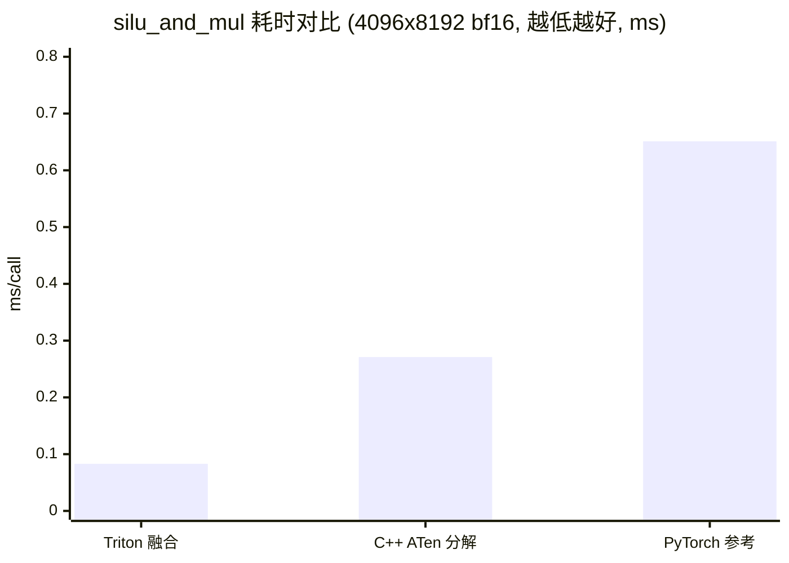

# 旗舰样例: B-fullstack——同一算子贯穿三层

## 定位

回答一个完整问题: **"一个厂商语言 kernel 从源码到真实推理，如何逐步验证？"**
以 `silu_and_mul`（C++ 实现）为锚定算子，一条故事线走完:

- L0 kernel 层: 写 C++ 源码 → JIT 编译 → 直测（精度 6/6 · 哨兵 · 性能）
- L2 op 层: 注册 `vendor:my-cpp` → dispatch 精确钉选
- L4 框架层: 注入真实 vLLM（前向调用计数 · 输出比对 · 黄金回归）

## 文件

| 文件 | 作用 |
|---|---|
| `example.py` | 三阶段编排（L0/L2/L4） |
| `fullstack_plugin.py` | dispatch 插件: C++ kernel 注册为 `vendor:my-cpp`（带 pid 分片计数） |

## 运行（约 3-4 分钟，含 2 次真实 vLLM 推理）

```bash
python3 examples/b-fullstack/example.py
```

## 实测输出要点

```
Stage 1/3  L0: JIT 编译完成 -> 精度 6/6 PASS · 哨兵 OK · 性能 0.44ms
Stage 2/3  L2: vendor.my-cpp 注册并被精确钉选
Stage 3/3  L4: 真实前向调用 2240 次 · 5/6 前2token一致 · 黄金匹配
```

## 关键设计

1. **基线钉 reference 路径**: 与黄金生成路径一致（黄金回归可比），
   与 `tests/framework_level/test_b` 同模式
2. **自定义数值实现 → 前 2 token 一致率断言**（随机权重贪心解码
   允许混沌分叉），恒等断言仅用于纯拦截场景
3. C++ kernel 经 `torch.utils.cpp_extension.load()` JIT 编译，
   ninja 缓存后重复加载近零耗时；编译目录 /tmp 不入库

这就是"算子在各层级自定义后在各层级验证"的完整模板——
把 `silu_and_mul` 换成你的算子、把 csrc 换成你的 kernel 即可复用。

## 配套开发报告

本样例的完整开发报告（按 `templates/op-development-report.md` 撰写，
环境配置自动生成、验证数据来自实测）: [report.md](report.md)

## 性能对比图



> 测量条件: 健康态进程、短采样(100 次)、参考实现为 fp32 物化分解
> （多中间张量，故偏慢）；C++ 版同为 ATen 分解故同量级。
> Triton 单融合 kernel 结构性领先（详见[开发报告](report.md) 第 5 章）。
