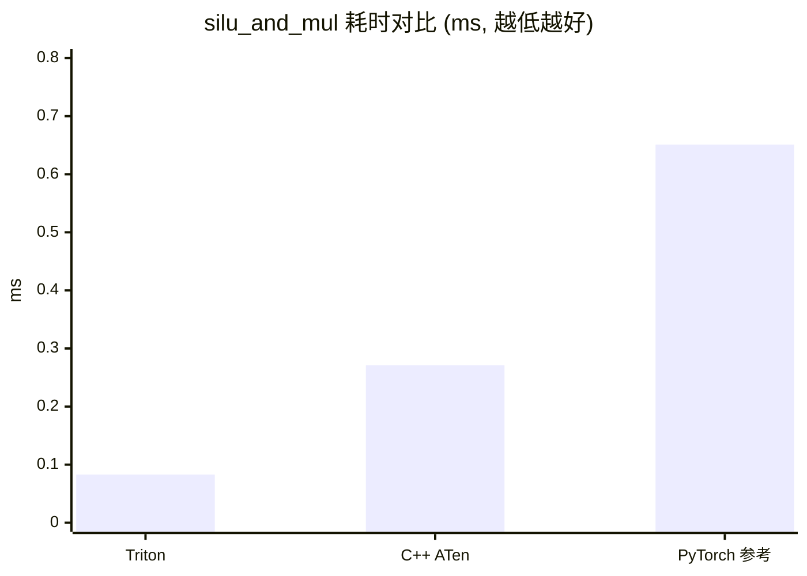

# 算子开发报告: silu_and_mul

| 项 | 值 |
|---|---|
| 算子名称 | `silu_and_mul` |
| 实现路线 | B |
| 目标设备 | `p800-kunlunxin` |
| 开发者 | FlagOS-OP 模板库（示例报告） |
| 日期 | 2026-08-24 |
| 报告状态 | 定稿（示例） |

## 1. 环境配置

> 自动生成: `scripts/env_snapshot.py --device p800-kunlunxin`；标注 `[手填]` 的项需人工补充。

### 1.1 硬件

设备 profile: **p800-kunlunxin**（vendor=kunlunxin，torch_device=cuda:1，visible=1,2）

```
    Mon Aug 24 21:19:00 2026       
    +-----------------------------------------------------------------------------+
    | XPU-SMI               Driver Version: 515.58       XPU-RT Version: N/A      |
    |-------------------------------+----------------------+----------------------+
    | XPU  Name        Persistence-M| Bus-Id        Disp.A | Volatile Uncorr. ECC |
    | Fan  Temp  Perf  Pwr:Usage/Cap|         Memory-Usage | XPU-Util  Compute M. |
    |                               |             L3-Usage |            SR-IOV M. |
    |===============================+======================+======================|
    |   0  P800 OAM           N/A   | 00000000:03:00.0 N/A |                    0 |
    | N/A   39C  N/A     91W / 400W |  31058MiB / 98304MiB |      0%      Default |
    |                               |      0MiB /    96MiB |             Disabled |
    +-------------------------------+----------------------+----------------------+
    |   1  P800 OAM           N/A   | 00000000:16:00.0 N/A |                    0 |
    | N/A   38C  N/A     94W / 400W |      0MiB / 98304MiB |      0%      Default |
    |                               |      0MiB /    96MiB |             Disabled |
    +-------------------------------+----------------------+----------------------+
    |   2  P800 OAM           N/A   | 00000000:1C:00.0 N/A |                    0 |
    | N/A   44C  N/A     93W / 400W |      0MiB / 98304MiB |      0%      Default |
    |                               |      0MiB /    96MiB |             Disabled |
    +-------------------------------+----------------------+----------------------+
    |   3  P800 OAM           N/A   | 00000000:2E:00.0 N/A |                    0 |
    | N/A   44C  N/A     94W / 400W |      0MiB / 98304MiB |      0%      Default |
    |                               |      0MiB /    96MiB |             Disabled |
    +-------------------------------+----------------------+----------------------+
```

拓扑 / 卡号映射 `[手填]`

### 1.2 软件栈

| 组件 | 版本 |
|---|---|
| OS / 内核 | Linux 6.8.0-87-generic |
| Python | 3.10.18 |
| PyTorch | 2.9.0+cu129 |
| vLLM | 0.13.0 |
| FlagGems | 4.2.1.rc.0 |
| vllm-plugin-FL | unknown |
| Triton | 3.0.0 |
| transformers | 4.57.1 |
| 厂商库 | [手填] |

### 1.3 设备 profile

```yaml
# 设备 Profile: Kunlunxin P800 (本机实测 case)
name: p800-kunlunxin
vendor: kunlunxin

auto_detect:
  module: torch_xmlir        # 可 import 即认定为该设备

device:
  torch_device: "cuda:1"     # 算子层测试设备 (XPU 经 XMLIR 伪装为 CUDA)
  visible_devices: "1,2"     # 框架级测试暴露的卡
  dispatch_key: CUDA         # A1 aten 注册的 dispatch key

framework:
  # 框架级 vLLM 引擎参数（本机已验证的稳定组合）
  tensor_parallel_size: 2
  distributed_executor_backend: mp
  max_model_len: 4096
  max_num_seqs: 50
  max_num_batched_tokens: 8192
  gpu_memory_utilization: 0.85
  enforce_eager: true
  enable_prefix_caching: false
  load_format: safetensors
  seed: 20260823
  model_path: /workspace/random-llm-models/llama-3.1-8b-like
  quirks:
    keep_default_prefer: true        # 保持继承值不覆盖（容器默认值是保护路径）
    require_two_visible_devices: true # 单卡路径曾出现厂商 reshape_and_cache 通道异常

vendor_delegate:
  # audit vendor 的 silu_and_mul 委托目标（厂商 kernel 原样透传）
  silu_and_mul: xtorch_ops.swiglu

reference_fallback: reference.torch

# 厂商硬件语言 kernel 直测清单（kernel 层 / --level kernel）
vendor_kernels:
  - name: xtorch_ops.gelu_tanh_and_mul
    op: gelu_and_mul
    out_mode: return
    adapter: gelu_tanh_and_mul
    n_inputs: 2
    expected_ok: false
    known_issue: XPU2(=cuda:1) 上非确定且输出 inf; XPU1(=cuda:0) 上 err≈0.125 正常（按设备分化 bug，known-issues #10）
  - name: xtorch_ops.silu
    op: silu
    out_mode: out_param
    adapter: out_param
    n_inputs: 1
    expected_ok: false
    known_issue: out 参数不写输出（与 swiglu 同类，known-issues #2）
  # 已知坏例: 哨兵检查应能抓出（验证检测能力）
  - name: xtorch_ops.swiglu
    op: gelu_and_mul
    out_mode: out_param
    adapter: out_param
    n_inputs: 2
    expected_ok: false
    known_issue: 独立 eager 调用不写输出（known-issues #2）
  # 自研 C++ kernel JIT 编译产物（csrc 闭环）
  - name: my_vendor_ops.gelu_and_mul
    op: gelu_and_mul
    out_mode: return
    adapter: two_tensor
    n_inputs: 2
    build: csrc
```

### 1.4 关键环境变量（采集时）

| 变量 | 值 |
|---|---|
| `CUDA_VISIBLE_DEVICES` | `1,2` |
| `VLLM_FL_PREFER` | `flagos|vendor` |
| `VLLM_FL_PLATFORM` | `kunlunxin` |
| `USE_FLAGGEMS` | `1` |
| `VLLM_FL_PER_OP` | `(未设置)` |
| `VLLM_FL_PLUGIN_MODULES` | `(未设置)` |

### 1.5 环境特殊性说明 `[手填]`

<容器限制 / 共享设备 / quirks 开关原因>

---

## 2. 算子定义

### 2.1 语义

vLLM `SiluAndMul` 语义：输入 `x[..., 2d]`，前半 `x1=x[...,:d]` 过 SiLU
后与后半 `x2=x[...,d:]` 相乘，输出 `[..., d]`。

```
out = silu(x1) * x2,   silu(v) = v * sigmoid(v)
```

### 2.2 PyTorch 参考实现

```python
def reference(x):
    d = x.shape[-1] // 2
    return (F.silu(x[..., :d].float()) * x[..., d:].float()).to(x.dtype)
```

### 2.3 接口签名

| 形态 | 签名 |
|---|---|
| C++ kernel（本实现） | `my_vendor_ops.silu_and_mul(Tensor x[..., 2d]) -> Tensor` |
| dispatch 调用 | `call_op("silu_and_mul", obj, x)`（impl_id `vendor.my-cpp`） |
| 模型内调用点 | vLLM Llama MLP 的 SiluAndMul 层 |

### 2.4 数值规格

| 项 | 值 |
|---|---|
| 支持 dtype | bf16 / fp16（kernel 内部 fp32 计算后 cast 回） |
| 容差 | bf16/fp16: 1e-2（.float() 后比） |
| 确定性 | 确定且输入敏感（哨兵验证通过） |

---

## 3. 实现说明

### 3.1 路线选择理由

厂商语言路线（B）：演示"自研 C++ kernel 从源码到真实推理"的完整闭环。
csrc 经 `torch.utils.cpp_extension.load()` JIT 编译（ninja 缓存后
重复加载近零耗时），Python 侧无手写构建。

### 3.2 kernel 实现要点

- 代码: `routes/b_vendor/csrc/vendor_kernel.cpp`（`silu_and_mul_vendor`）
- fp32 中间精度：`x.to(kFloat32)` → narrow 拆分 → silu·mul → cast 回
- pybind11 绑定，返回新 Tensor（return 模式，无 out 参数）

### 3.3 注册与分发

- 插件: `examples/b-fullstack/fullstack_plugin.py` 注册
  `OpImpl(op=silu_and_mul, impl_id=vendor.my-cpp, kind=VENDOR, priority=100)`
- 进程内钉选: `with_preference("vendor") + with_allowed_vendors("my-cpp")`
- 框架内钉选: `VLLM_FL_PER_OP="silu_and_mul=vendor:my-cpp|reference"`
- 调用计数: pid 分片文件（消除 TP 多 worker 写竞争）

---

## 4. 验证结果

| 层级 | 状态 | 耗时 | 关键结论 |
|---|---|---|---|
| kernel 直测 | ✅ PASS | ~8s | 精度 6/6、哨兵(确定性+输入敏感)通过 |
| op 注册/分发 | ✅ PASS | ~7s | 注册为 7 个 impl 之一并被精确钉选 |
| framework 真实推理 | ✅ PASS | ~100s | 真实前向调用 2240 次 |
| 跨层一致性 L0↔L2 | ✅ PASS | 7.9s | 4×4 全零误差（同 csrc 模块 gelu_and_mul 锚定） |
| 黄金回归 | ✅ PASS | — | 基线 matches golden consensus (prefix 3) |

### 4.1 kernel 层明细

| shape | dtype | vs 参考 max_err | 哨兵 | 备注 |
|---|---|---|---|---|
| (64, 1024) | bf16 | <1e-2 | 通过 | — |
| (128, 5120) | bf16 | <1e-2 | 通过 | vLLM 典型 FFN 维度 |
| (1, 14336) | bf16 | <1e-2 | 通过 | 单 token 长 FFN |
| 同上三 shape | fp16 | <1e-2 | 通过 | — |

JIT 编译: 冷编译 14.2s，缓存后 0.3s。

### 4.2 framework 层明细

- 调用计数: **2240 次**（pid 分片汇总，6 prompts × 32 token × 32 层量级吻合）
- 输出比对: 5/6 prompts 前 2 token 一致（自定义数值实现标准:
  ≥ 2/3×N，通过）——分歧源于随机权重贪心解码对数值微差的混沌放大，
  非 kernel 错误
- 黄金回归: 基线（钉 reference 路径）匹配黄金共识前缀 3

---

## 5. 性能

同 shape (4096, 8192) bf16 下，同算子四实现横评（3 轮中位数，健康态进程）:

| 实现 | 耗时/call | 有效带宽 | vs 参考 |
|---|---|---|---|
| **Triton（A2 路线同算子）** | **0.083 ms** | ~1288 GB/s | **~7x** |
| 本实现（C++ JIT / ATen 分解） | 0.27–0.75 ms* | ~250–370 GB/s | 1–2.4x |
| PyTorch 参考（fp32 分解） | 0.23–0.65 ms* | ~435 GB/s | 1x |
| 厂商 xtorch_ops.swiglu | 不可比 | — | 语义损坏（known-issues #2） |

\* 本实现与参考同量级且跨进程波动大——两者都是**多算子分解**
（fp32 物化→sigmoid→mul→cast，5 次串行 kernel + 中间张量），
属教学骨架而非优化 kernel。Triton 版单融合 kernel 零中间物化，
结构性地快 3–8x，是性能上限参照。

> 测量警示: 本共享设备上同进程串跑多实现后，C++ 路径观测过
> 200x 劣化（设备状态污染，换进程即恢复）——基准在独立进程中运行（避免设备状态污染）
> 短采样（见 known-issues 分配器陷阱与设备分化条目）。

> 基准: shape (4096, 8192) bf16，短采样 100 次 + synchronize
> （规避分配器池增长失真）。有效带宽为读入 2d + 写出 d 的近似。

---



## 6. 已知问题与风险

| # | 问题 | 影响 | 缓解 | 状态 |
|---|---|---|---|---|
| 1 | 本机厂商栈多个 kernel 损坏（swiglu/silu 不写输出、gelu_tanh_and_mul@XPU2 输出 inf） | 无——本实现不依赖厂商现成 kernel | 哨兵检查持续守护 | 已记录 known-issues |
| 2 | 自定义数值实现输出与 reference 路径混沌分叉 | 报告/比对采用前 2 token 一致率（非全量一致断言） | 前 2 token 一致率标准 | 已缓解 |
| 3 | embedding 静默越界（tokenizer>词表） | 框架测试输入非法 | tokenize+词表钳制 | 已缓解 |

---

## 7. 结论与后续

### 结论

silu_and_mul（C++ 实现）通过全部三层验证 + 跨层一致性 + 黄金回归，
达到验收标准。作为**首个全链路开发样例**，同时证明了：
JIT 编译闭环、vendor 注册钉选、真实推理注入、分片计数、
自适应断言等机制端到端可用。

### 后续

- [ ] 性能优化空间：当前 fp32 中间全量物化，可探索 fused/减内存 pass
- [ ] 在真实权重模型上复核输出质量（随机权重无法评估语义）
- [ ] 多设备 profile 下复跑（nvidia/cpu 参照）

---

## 附录 A: 复现命令

```bash
python3 examples/b-fullstack/example.py                     # 全链路一键
python3 run.py --route b --level kernel --device p800-kunlunxin
python3 run.py --route b --level op --device p800-kunlunxin
python3 run.py --route b --level framework --device p800-kunlunxin
python3 run.py --consistency --device p800-kunlunxin
python3 scripts/report.py --device p800-kunlunxin
```

## 附录 B: 相关产物

| 产物 | 路径 |
|---|---|
| C++ kernel | `routes/b_vendor/csrc/vendor_kernel.cpp` |
| dispatch 插件 | `examples/b-fullstack/fullstack_plugin.py` |
| 结果 JSON | `results/p800-kunlunxin_b_*.json` |
| 黄金 | `golden/p800-kunlunxin_golden.json` |
| 本报告 | `examples/b-fullstack/report.md` |
