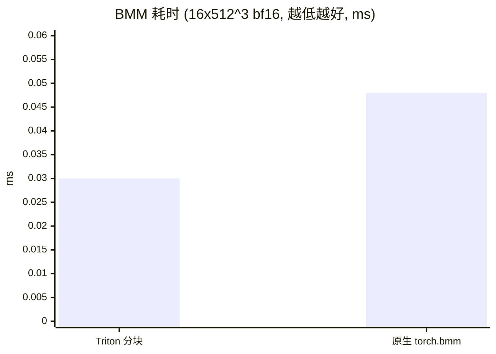
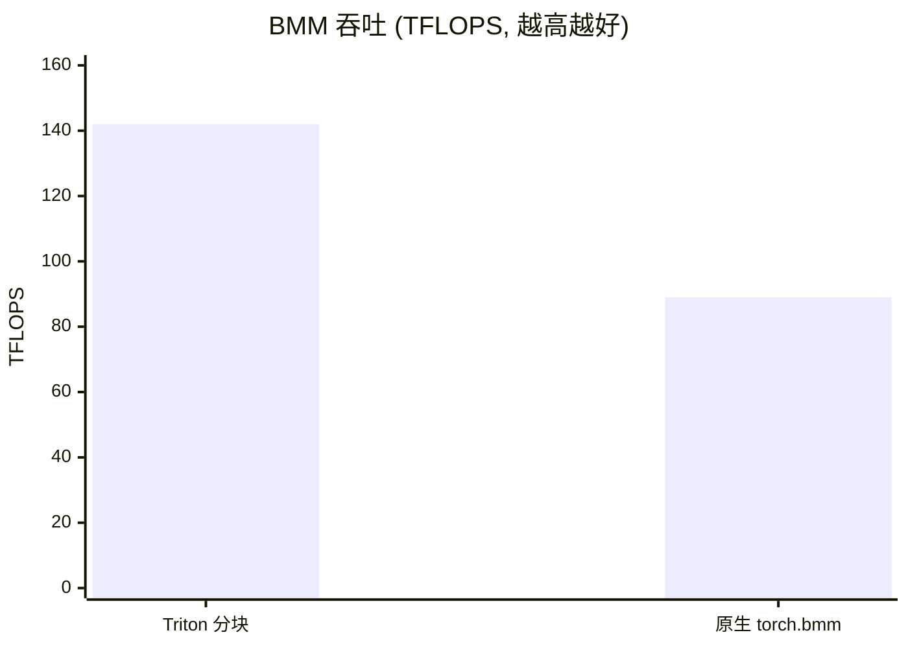

# 全链路样例: BMM（批处理矩阵乘）

[← 样例索引](../README.md)

## 定位

`torch.bmm`（aten 算子）从 Triton kernel 到应用层的一条线，与
[b-fullstack](../b-fullstack/)（dispatch 算子 + C++）互补:

```
kernel 层:  Triton 分块 BMM（tl.dot, fp32 累加）直测
框架层 aten:    Library("aten","IMPL").impl("bmm",...) → torch.bmm 拦截
应用层:  mini-attention 前向（显式 3 次 bmm/步）
```

## 运行

```bash
python3 examples/bmm-fullstack/example.py        # 约 10 秒
```

## 实测输出

```
精度: 12/12 组合 PASS（fp32 累加，相对误差 <5%）
性能: Triton=0.030ms (142 TFLOPS)  torch.bmm=0.048ms  相对=1.59x
拦截: torch.bmm -> Triton kernel
mini-attention 触发 aten::bmm: 4 次, 输出位级一致
```

## ⚠️ 厂商栈关键坑（known-issues #11）

本样例开发过程发现的**根本性问题**: 裸 `@triton.jit` kernel 启动
若不包 `torch_device_fn.device(...)` 上下文，**首次编译启动正常，
之后所有启动静默 no-op**（输出保持未初始化内存）。

- FlagGems 全部算子内部都包了该上下文——所以生产从未暴露
- 表现极具迷惑性: 首次调用结果完全正确；后续调用不报错、
  只留下 uninitialized 内存；性能基准也会测到假数据（本样例
  曾测得 0.19ms 假性能，修复后真实为 0.030ms 且快 1.59x）
- 排查手段正是本库的哨兵检查（zeros 预填 → 调用 → 零占比）

```python
from flag_gems.runtime import torch_device_fn
with torch_device_fn.device(x.device):
    my_kernel[grid](...)
```

## 为什么 L4 用 mini-attention 而非 vLLM/nn.MultiheadAttention

- vLLM 注意力走自定义 attention backend，不经 `torch.bmm`
- `nn.MultiheadAttention` 的 fast-path（`_native_multi_head_attention`）
  在本栈有维度问题；标准路径可用但不如手写 mini-attention 直观
- mini-attention 每次前向显式调 3 次 bmm，是干净的应用层消费者

## 性能对比图





> 修复 [#11](../../docs/known-issues.md) 前的"0.19ms"是 no-op 假数据；
> 真实测量下自研 Triton BMM 比原生快 1.59x（fp32 累加、64³ 分块）。
