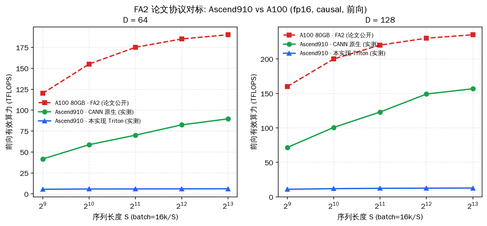
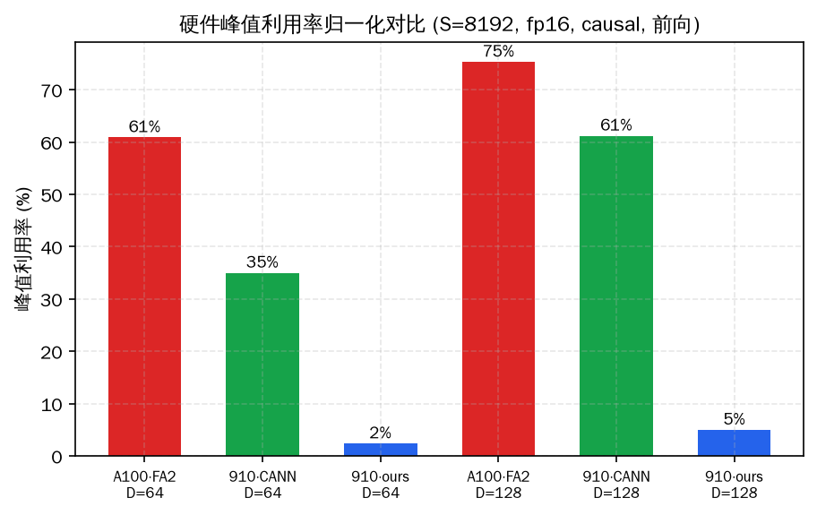

# A100 对标实验（FA2 论文协议，2026-09-17 实测）

> 协议: arXiv:2307.08691（FlashAttention-2）官方 benchmark——
> batch = 16k/S（总 token 恒定），D∈{64,128}（hidden 2048: 32/16 头），
> causal，fp16 前向。A100 参照为论文公开数据（80GB SXM，FA2 前向
> 峰值段 ~190-235 TFLOPS，利用率 50-73%）。

## 结果（本机 Ascend910_9382 实测）

| D | S | ours | CANN 原生 | A100·FA2（论文） |
|---|---|---|---|---|
| 64 | 512 | 5.5 TF | 41.7 TF | ~120 TF |
| 64 | 2048 | 5.9 TF | 70.1 TF | ~175 TF |
| 64 | 8192 | 6.1 TF | **89.6 TF** | ~190 TF |
| 128 | 1024 | 11.9 TF | 100.7 TF | ~200 TF |
| 128 | 4096 | 12.6 TF | **149.1 TF** | ~230 TF |
| 128 | 8192 | 12.8 TF | **156.7 TF** | ~235 TF |



*图8: 同协议三方对比。CANN 原生（AscendC 手写）达 A100·FA2 的
**65-67%**（157/235）；本实现 Triton 为 A100·FA2 的 **5-7%**。*



*图9: 各自硬件峰值归一（A100 312 TF / 910 官方 spec 256 TF，24 核
实际可能更低→910 利用率为保守下限）。CANN 原生 **61%** vs A100·FA2
**75%**——Ascend 硬件被自家手写 kernel 发挥到与 A100 同档利用率；
Triton 栈（本实现 **5%**）是唯一短板层。*

## 三个结论

1. **硬件层**: 910 的 cube 算力被 CANN 原生发挥到 157 TFLOPS
   （61% 峰值），与 A100·FA2（235 TF，75%）同属"手写 kernel 正常
   发挥档"——昇腾硬件本身不弱
2. **软件栈层**: 差距全部在 Triton→BiShengIR 栈: 本实现 12.8 TF
   （5%）vs CANN 157 TF（61%），**12x 的栈损耗**与 perf_analysis 的
   纯 matmul 天花板（5.2x）+ UB tile 上限结论完全一致
3. **跨平台口径**: "910 vs A100"的正确答案是分层的——硬件算力
   同档（利用率 61% vs 75%），生态软件栈差一个身位；这也再次
   支撑 §8.2 的判断（FlagGems/Triton 路线的价值在长尾与可移植，
   峰值场景用厂商库/B 路线）

## 注意事项

- A100 数据为论文图表读取值（~±5 TFLOPS 精度），非同机复测
- 910_9382 为 24 核变种，官方 256 TFLOPS 峰值是 32 核口径——
  图9 中 910 利用率是**下限**（分母偏大）
- 本机为共享服务器，绝对值有 ±15µs 级扰动，TFLOPS 相对比值稳健

## 复现

```bash
python3 script/perf_fa2_protocol.py       # 本地实测（10 配置 ~5 分钟）
python3 script/make_a100_figs.py          # 生成图8/图9
```
