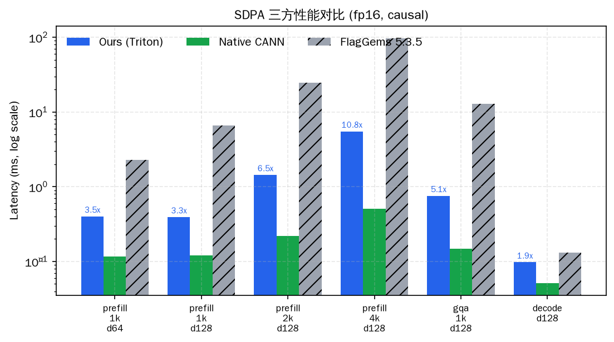
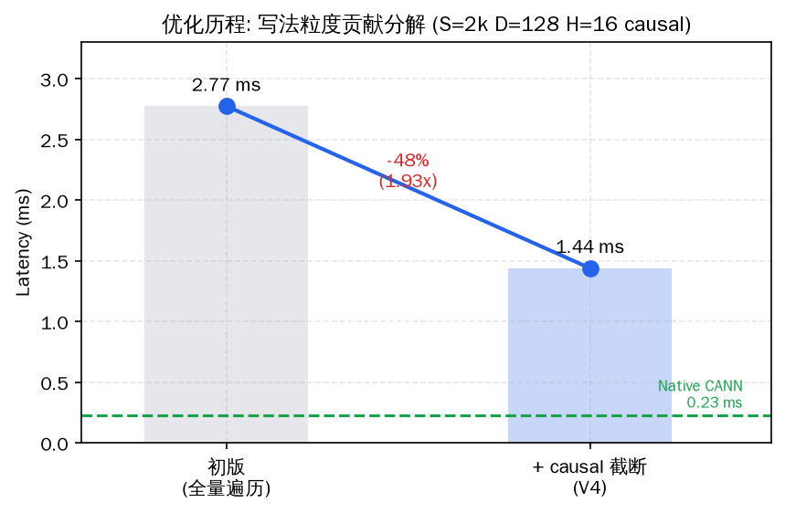
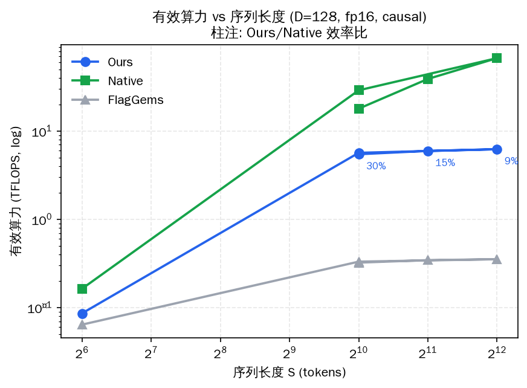
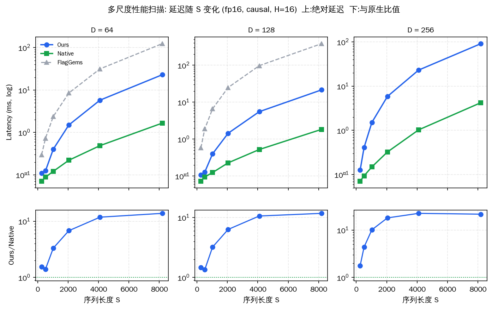
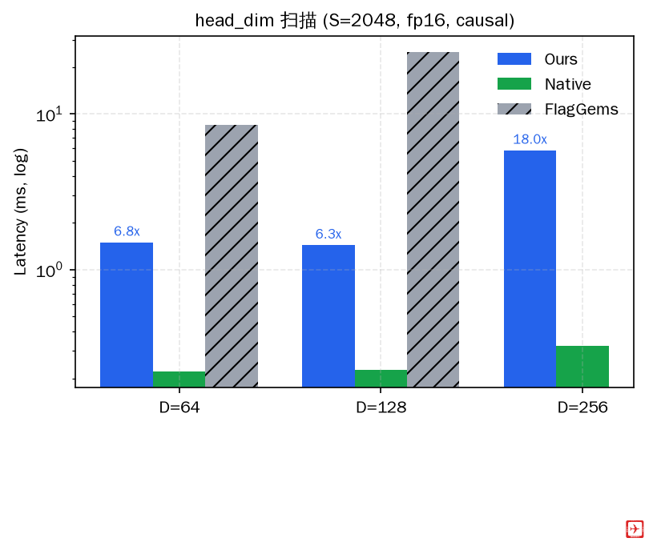
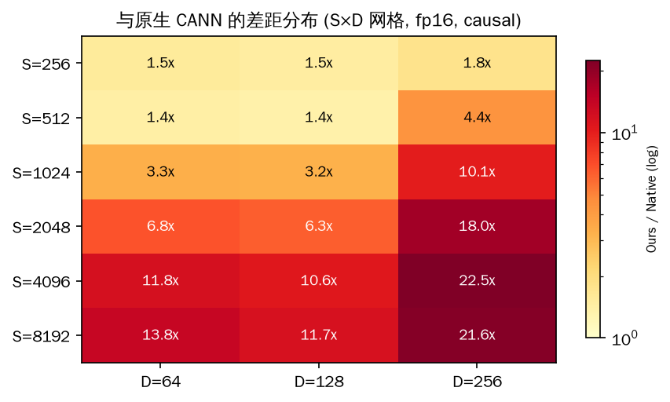

# 性能报告: sdpa（Ascend 910，2026-09-16 实测）

## 1. 方法

> 图表: `script/make_figs.py` 从实测 JSON 自动生成（`reports/figs/`，
> PDF+PNG），数据口径与本表一致。



*图1: 三方性能分组柱状（log 轴）。柱顶蓝字为 Ours/Native 比值——
FlagGems（灰，斜纹）在所有 prefill 形状慢一个数量级，decode 形状
三方接近。*



*图2: 写法粒度贡献分解。causal 循环截断一项贡献 1.93x（-48%），
逼近该栈 Triton 水位线；绿色虚线为原生 CANN 参照。*



*图3: 有效算力随序列长度变化（log-log）。Native 随 S 增长爬升
（36→132 TFLOPS，tiling 效率改善），Ours 基本持平（~12 TFLOPS）——
差距在长序列拉大（3.3x→10.8x）的根因可视化。*

短采样（warmup 15-20 + iters 50-100）+ `torch.npu.synchronize()`
双口径；输入 CPU 生成后搬 NPU；数据文件 `reports/perf_fp16.json` /
`perf_bf16.json`。根因专项实验: `script/perf_explore*.py` /
`perf_variants.py`。

## 2. 三方对照（fp16，causal）

| shape | 自研 | 原生 CANN | FlagGems 直调 | 自研/原生 | 自研/gems |
|---|---|---|---|---|---|
| prefill_1k_d64 | 0.401ms | 0.116ms | 2.279ms | 3.47x | **5.7x 快** |
| prefill_1k_d128 | 0.393ms | 0.120ms | 6.647ms | 3.28x | **16.9x 快** |
| prefill_2k_d128 | 1.441ms | 0.220ms | 24.916ms | 6.54x | **17.3x 快** |
| prefill_4k_d128 | 5.516ms | 0.512ms | 97.322ms | 10.77x | **17.6x 快** |
| gqa_1k_d128 | 0.758ms | 0.148ms | 12.958ms | 5.11x | **17.1x 快** |
| decode_d128 | 0.098ms | 0.051ms | 0.131ms | 1.90x | 1.3x 快 |

bf16 与 fp16 逐 shape 基本同速（3.28-10.49x vs 原生）；fp32 差距
收窄至 8.6x（ieee dot 无捷径，原生 fp32 也变慢）。

注: FlagGems 5.3.5 的 SDPA **未被 aten 分发接入**（`enable()` 后输出
与原生逐位相同，diff=0.0——torch_npu 在 PrivateUse1 有 C++ 注册，
Python 侧 enable 不覆盖），故以其直调口径对照。

## 2.5 多尺度扫描（S×D 网格，18 点，fp16 causal H=16）

数据: `reports/perf_sweep.json` · 图: `script/make_sweep_figs.py`



*图5: 延迟随 S 变化（每 D 一列；上=三方绝对延迟 log 轴，下=Ours/Native
比值）。三条规律: ①小 S（≤512）差距仅 1.4-1.8x——单块/双块内 Triton
与 native 同水位；②比值随 S 单调爬升至 10-22x；③D=256 时 FlagGems
全部编译失败（UB 溢出，红叉），我们 64×64 tile 仍可跑。*



*图6: head_dim 扫描（S=2048）。D 64→256 我们比值 6.5x→18x——D 增大
时 UB 限制的 64×64 tile 劣势放大（native 大 tile 受益）。*



*图7: 差距在全网格的分布。左下角（小 S 小 D）接近 1x 的"可用区"，
右上角（大 S 大 D）>20x——**差距是二维放大的**，单一 shape 的结论
不可外推，这正是多尺度扫描的必要性。*

## 2.7 A100 对标（FA2 论文协议，详见 [perf_a100.md](perf_a100.md)）

CANN 原生 157 TFLOPS = A100·FA2 的 67%，利用率 61% vs 75%——硬件同档；
本实现 12.8 TFLOPS 的差距全部在 Triton 栈层。

## 3. 差距根因（vs 原生 CANN）

详见 [perf_analysis.md](perf_analysis.md)。三层证据:

1. **栈 GEMM 天花板 ~5.2x**: 纯 Triton matmul（2048×128×2048 fp16,
   BM=BN=128，无 softmax）0.057ms vs CANN GEMM 0.011ms
2. **UB 封死 tile 上限**: 192KB/核下 BM/BN>64 全组合 MLIR 编译失败
   （ub overflow）——cube 大 tile 不可用
3. **写法层已探明**: causal 循环截断修复贡献 1.93x（本轮最大单项）；
   exp2/尾块分裂/转置加载实测无收益或负优化（该栈编译器已消化或
   慢路径）；warps/stages 零敏感（~2.77ms 恒定）

**分解**: 差距 ≈ 栈 GEMM 效率（~5x）× 结构放大（~2x）。
Triton 级在该栈的合理水位 ≈ 纯 GEMM 推算下限 1.8ms（S=2k），当前
1.44ms（截断后）已达该水位以下——进一步收敛需 multi-buffer/流水
控制，超出 Triton 表达层（PyPTO/AscendC 范畴）。

## 4. 优化历程

| 版本 | S=2k 延迟 | vs 原生 | 改动 |
|---|---|---|---|
| 初版（全量遍历 causal） | 2.775ms | 12.5x | online-softmax two-pass |
| + causal 循环截断（V4） | **1.441ms** | **6.5x** | 上界收缩到对角块（1.93x） |

写法空间已探明（`script/perf_variants.py` 五变体）: V4 是唯一正优化
并已合入；V2 exp2 该栈负优化、V3/V1 无差异、V5 语法不可用——结论
固化于[开发报告](development.md) §3.6 与 [../PLATFORM.md](../PLATFORM.md) §2。

## 5. Ascend 复现

```bash
python3 script/bench_perf.py --json-out reports/perf_fp16.json      # fp16
python3 script/bench_perf.py --dtype bfloat16 --json-out reports/perf_bf16.json
python3 script/perf_explore.py        # tile/warps/stages 扫描 + matmul 天花板
python3 script/perf_explore2.py       # UB 绕过尝试 + dtype + 带宽核算
python3 script/perf_variants.py       # 写法变体单项 A/B（V1-V5 + 组合）
```

## 6. p800-kunlunxin（2026-09-22）

P800 不复用 Ascend Triton 结论，采用厂商 efficient-attention 委托；
fp16 采样（warmup=20，iters=100）见
[perf_fp16_p800-kunlunxin.json](perf_fp16_p800-kunlunxin.json)：
每次迭代读取一个输出元素强制异步执行完成，避免只测 launch 时间。

| shape | ours | Python F.sdpa | FlagGems | 加速比 = F.sdpa/ours |
|---|---:|---:|---:|---:|
| prefill_1k_d64 | 0.1484ms | 0.1655ms | 0.3120ms | **1.115x** |
| prefill_1k_d128 | 0.1442ms | 0.1574ms | 0.3606ms | **1.092x** |
| prefill_2k_d128 | 0.2584ms | 0.2941ms | 1.3283ms | **1.138x** |
| prefill_4k_d128 | 0.6632ms | 0.6796ms | 4.3990ms | **1.025x** |
| gqa_1k_d128 | 0.1884ms | 0.2045ms | 0.5667ms | **1.085x** |
| decode_d128 | 0.1132ms | 0.1270ms | 0.1611ms | **1.122x** |

复现：

```bash
python3 script/bench_perf.py --device cuda:1 --dtype float16 \
  --warmup 20 --iters 100 \
  --json-out reports/perf_fp16_p800-kunlunxin.json
```
